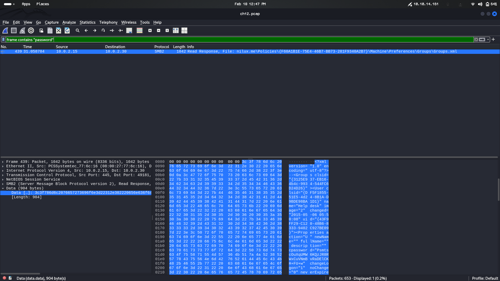

# [Active Directory - GPO](https://www.root-me.org/en/Challenges/Forensic/Active-Directory-GPO)

***Statement: 
During a security audit, the network traffic during the boot sequence of a workstation enrolled in an Active Directory was recorded. Analyze this capture and find the administrator’s password.***

- When a commputer is a part of active directory domain, it communicate with the domain controller as soon as it start up , before  any user logs into the system
- During boot process the systme often authenticate various services, and machine accounts 
- Some times it may pull configurations data like startup scripts fomr Group policy objects. 

- So in this task we are given with a pcap file . we have to analyze the file and find administratoe password.

- Let's start our anlysis . open the pcap file in wireshark
- First thing i want to do is see the protocol statistics
```
data,llmnr,drsuapi,srvsvc,nbns,udp,dns,dcerpc,arp,ldap,epm,igmp,kerberos,nbss,frame,tcp,ip,cldap,rpc_netlogon,ntp,_ws.short,lsarpc,smb,eth,smb2
```
- We can find varous protocls in our pcap file, even we can see the legacy smb version 1 protocol
- Then i wanted to check is thery any frame that contians the term password. we can do this by using a wreshrk filter
```
frame contains "password"
```

- We can see on packet containing the string password .
- In the bottom left pane, Data section copy the hex encoded data. and paste it into a decoder tool hex to ascii.

```
<?xml version="1.0" encoding="utf-8"?>
<Groups clsid="{3125E937-EB16-4b4c-9934-544FC6D24D26}"><User clsid="{DF5F1855-51E5-4d24-8B1A-D9BDE98BA1D1}" name="Helpdesk" image="2" changed="2015-05-06 05:50:08" uid="{43F9FF29-C120-48B6-8333-9402C927BE09}"><Properties action="U" newName="" fullName="" description="" cpassword="PsmtscOuXqUMW6KQzJR8RWxCuVNmBvRaDElCKH+FU+w" changeLogon="1" noChange="0" neverExpires="0" acctDisabled="0" userName="Helpdesk"/></User><User clsid="{DF5F1855-51E5-4d24-8B1A-D9BDE98BA1D1}" name="Administrateur" image="2" changed="2015-05-05 14:19:53" uid="{5E34317F-8726-4F7C-BF8B-91B2E52FB3F7}" userContext="0" removePolicy="0"><Properties action="U" newName="" fullName="Admin Local" description="" cpassword="LjFWQMzS3GWDeav7+0Q0oSoOM43VwD30YZDVaItj8e0" changeLogon="0" noChange="0" neverExpires="1" acctDisabled="0" subAuthority="" userName="Administrateur"/></User>
</Groups>
```
- Well this  maybe a Groups.xml file which is tipycally from /SYSVOL/Policies
- We can see password hases of user helpdesk and administrator
```
Helpdesk cpassword="PsmtscOuXqUMW6KQzJR8RWxCuVNmBvRaDElCKH+FU+w"
Administrator cpassword="LjFWQMzS3GWDeav7+0Q0oSoOM43VwD30YZDVaItj8e0"
```
- Microsoft used a static, publicly known AES-256 key to encrypt passwords stored in Group Policy XML files.
- We can decrypt these hashes using a tool called **gpp-decrypt**
```
gpp-decrypt LjFWQMzS3GWDeav7+0Q0oSoOM43VwD30YZDVaItj8e0

TuM@sTrouv3
```
- Administrator password is **TuM@sTrouv3**