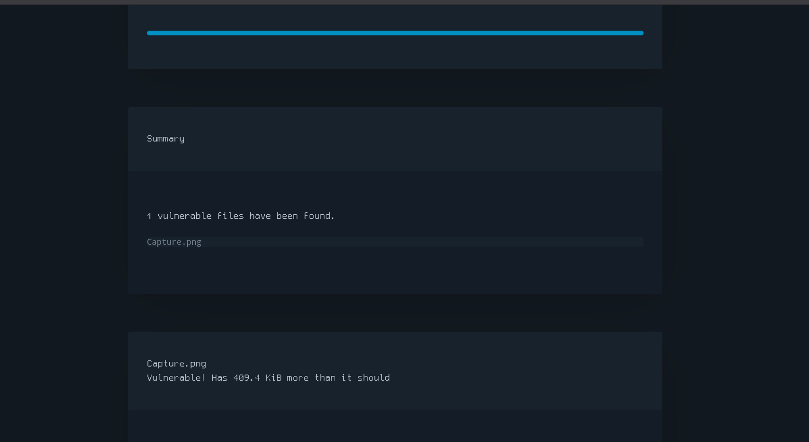
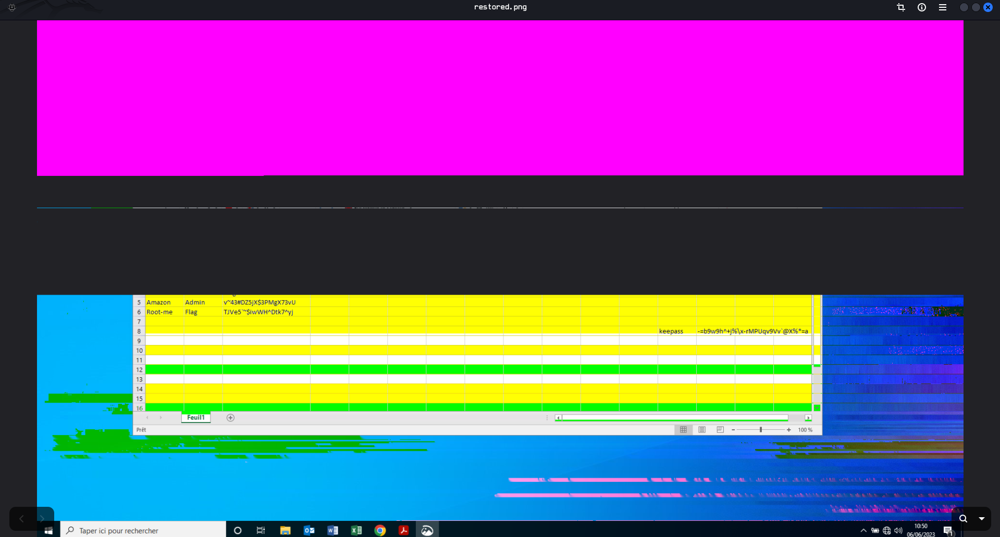
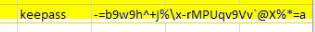
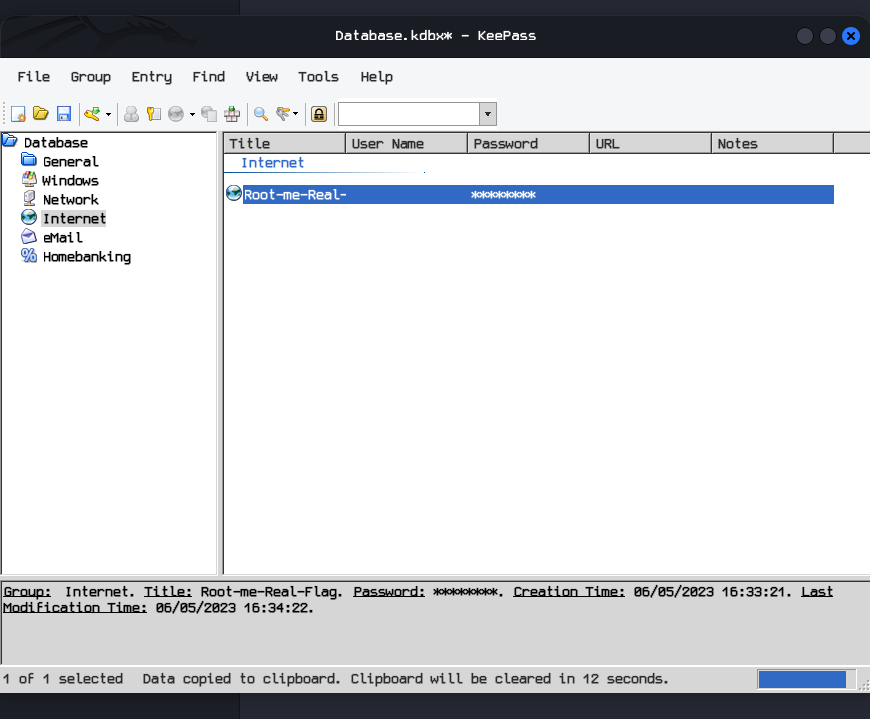

# [Capture this](https://www.root-me.org/en/Challenges/Forensic/Capture-this) 

**Statement**
An employee has lost his KeePass password. He couldn’t remember it, and couldn’t find his password file. After hours of searching, it turns out that he has sent a screenshot of his passwords to one of his colleagues, but it’s still nowhere to be found.

He’s asking for your help to find him.
It’s up to you

sha256sum: 028c8561f087da873b08968d55141dcfc8f10a47e787f79c35b2da611a5e07ce

## Solution 

- Download the challenge file and extract its contents.
```
> ls
ch42.zip

> unzip ch42.zip 
Archive:  ch42.zip
inflating: Capture.png             
extracting: Database.kdbx   
 ```

- We are given an image file and the KeePass database.
 
- The screenshot contains several other passwords, but not the KeePass password.
- If you observe closely, on the right side, we can see the letter **k**. That may be something like KeePass. 
- But we can't see cause the screenshot is cropped.
- So I googled "How to extract a completed image from a cropped image," but there is a  lot of nonsense.
- But after some time, I found something called aCropalypse.

***Note: aCropalypse (CVE-2023-21036) is a critical security vulnerability found in image editing tools, notably Google Pixel’s Markup and Windows Snipping Tool, that allows recovery of cropped or edited image data. By failing to truncate files, edited images retain hidden original data, letting attackers reconstruct the full, unredacted image. ***

- I found this [site](https://lordofpipes.github.io/acropadetect/), which tells whether a file is vulnerable or not. 
- I checked the capture.png file. It is vulnerable.	


- I found this [github](https://github.com/frankthetank-music/Acropalypse-Multi-Tool). which contains a [Python script](https://github.com/frankthetank-music/Acropalypse-Multi-Tool/blob/main/acropalypse.py) to extract a complete image from files vulnerable to this CVE.

- You can install the gui tool if you want, but we don't need that. Instead, download or copy the acropalypse.py script. 
- Then i creted a small Python script called exploit.py
```
from acropalypse import Acropalypse

a = Acropalypse()

a.reconstruct_image(
    cropped_image_file="Capture.png",
    img_width=1920,
    img_heigth=1080,
    rgb_alpha=True
)
```
- The script simply imports the Acropalypse class from acropalypse.py and calls its **reconstruct_image()** method.
- Save both scripts in the same directory and then run the script.
```
python3 exploit.py                                                                                                               
Found 419252 trailing bytes!
Extracted 419148 bytes of idat!
building bitstream...
reconstructing bit-shifted bytestreams...
Scanning for viable parses...
Found viable parse at bit offset 278910!
Generating output PNG...
Done!

```

- The restored image is saved to /tmp/restored.png


-Now we can see the KeePass password 

- The password is -=b9w9h^+j%\x-rMPUqv9Vv`@X%*=a

- Now open the KeePass database and enter the password. We get the password for the Root-me lab.

**Root-me paword is  @cropalypse_vuln_is_impressive**
