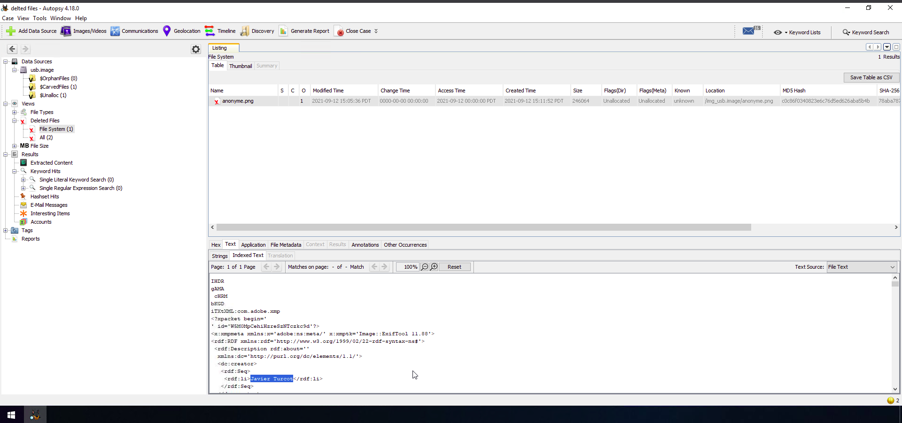

# Deleted file

You can look all you want, but this key is empty...

Your cousin found a USB drive in the library this morning. He’s not very good with computers, so he’s hoping you can find the owner of this stick!

The flag is the owner’s identity in the form firstname_lastname

sha256sum: cd9f4ada5e2a97ec6def6555476524712760e3d8ee99c26ec2f11682a1194778


- Download the challenge file.
```
ls
ch39.gz
~/Root_me/Forensics ❯ file ch39.gz 
ch39.gz: gzip compressed data, from Unix, original size modulo 2^32 32512000
```
- Well, this is a gzip file lets unzip it. 
```
gunzip ch39.gz

ls
ch39

```
- Now we have a ch39 tar archive 

```
file ch39  
ch39: POSIX tar archive (GNU)
```
- untar the file using tar.
```
tar -xvf ch39 
usb.image
```
- Now we have a USB.image file. I want to use autopsy tool for disk image analysis.
- Open autopsy -> create a new case -> select case directroy -> now select image for analysis(Type = disk image) -> analyze the disk. 
- Now we can see the contents of the disk.
- In the Deleted files fields we can find an image file.

- view it in text format. there we can see the owner of the file.
- The password is **javier_turcot** 
