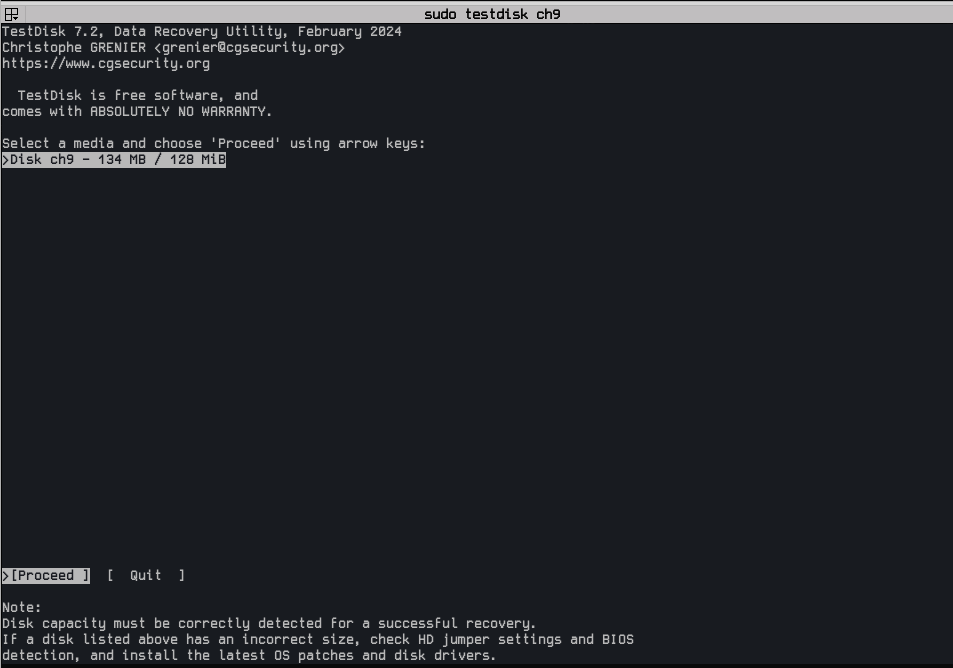
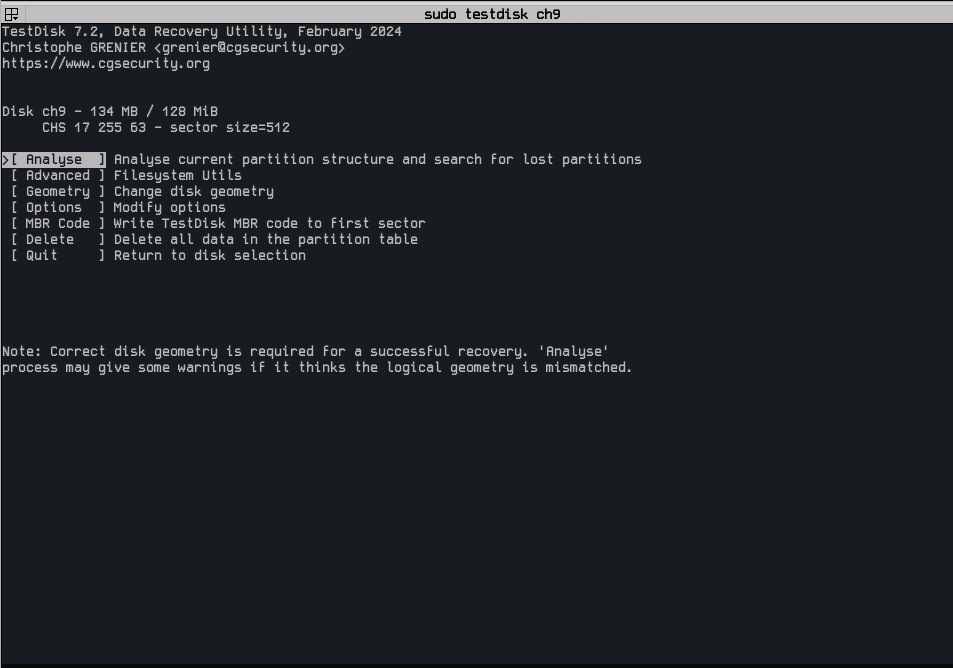
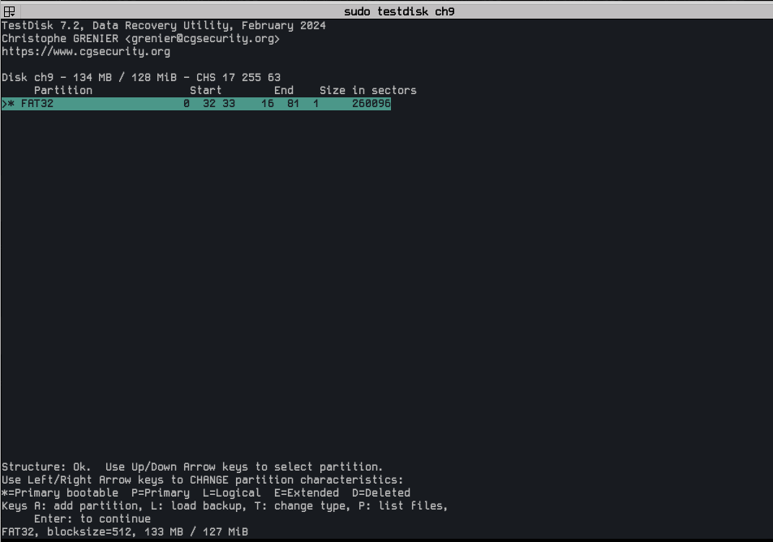
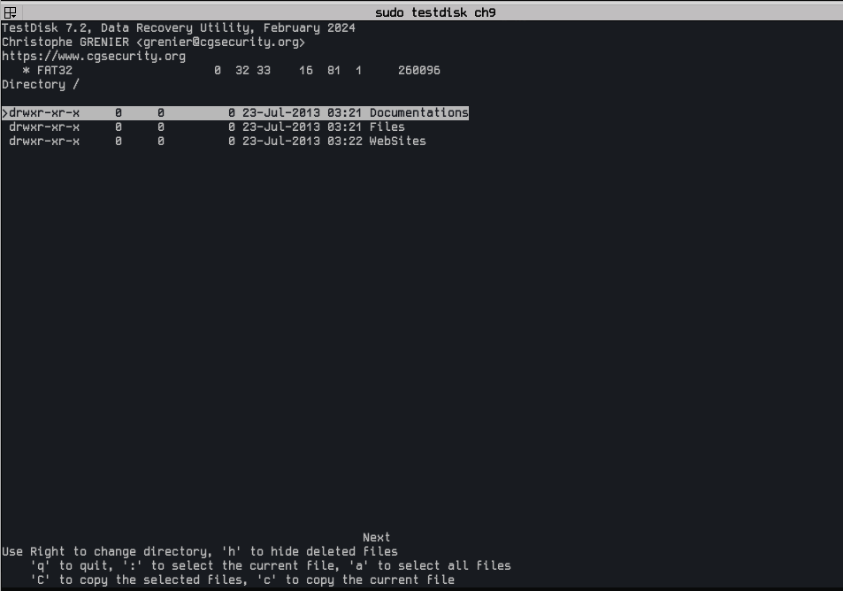
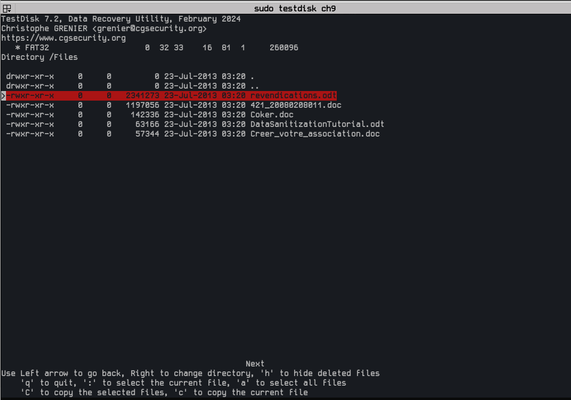
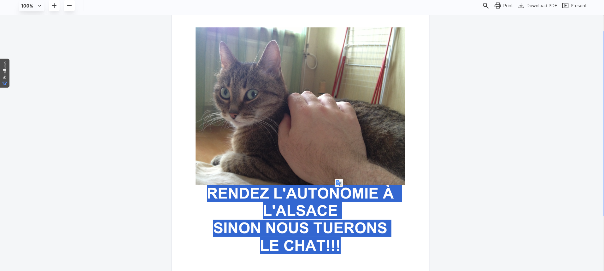
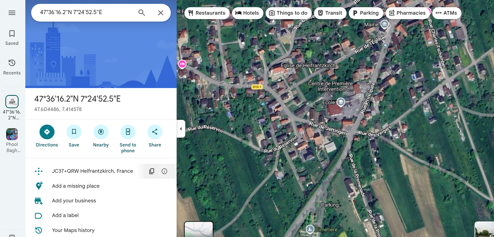

# [Find the cat](https://www.root-me.org/en/Challenges/Forensic/Find-the-cat)

***Statement
The president’s cat was kidnapped by separatists. A suspect carrying a USB key has been arrested. Berthier, once again you have to save the Republic! Analyze this key and find out in which city the cat is retained!
The md5sum of the archive is edf2f1aaef605c308561888079e7f7f7. Input the city name in lowercase.***

- Download the attachment and unzip it.
```
gunzip ch9.gz 
```

```
file ch9 
ch9: DOS/MBR boot sector; partition 1 : ID=0xb, start-CHS (0x0,32,33), end-CHS (0x10,81,1), startsector 2048, 260096 sectors, extended partition table (last)
```
- This means ch9 is not a normal file — it’s a disk image containing an MBR partition table.
- mount the partition to see its contents. 
```
❯ sudo mount -o loop,offset=1048576 ch9 /mnt

❯ cd /mnt                                                                                                                                                                                                          6s
/mnt ❯ ls
Documentations  Files  WebSites
```
- Those directories have a couple of files.
- nothing interesting found. 
- I tried to find deleted files. For that, I am going to use a tool called **testdisk**
- TestDisk is a free, open-source data recovery software designed to recover lost, deleted, or corrupted partitions and fix non-booting disks.

```
sudo testdisk ch9
```


- The click enter-enter
- then select analyze and press enter


- Then Quick search 

- Press p to list the files and use the arrow keys to navigate through directories

- Deleted files are marked in red.
- Inside **Files** directory we can find a file with name **revendications.odt**

- Select the file and press C, and again press C. That copies the selected file to your current directory.

```
file revendications.odt 
revendications.odt: OpenDocument Text
```
***An OpenDocument Text (.odt) file is an open-source, XML-based word processing file format commonly used for documents like reports and resumes, serving as a free, interoperable alternative to .docx. ODT files are structured as ZIP-compressed containers, making them easily readable across operating systems via LibreOffice, OpenOffice, Google Docs, and MS Word. ***

```
unzip -l revendications.odt
Archive:  revendications.odt
  Length      Date    Time    Name
---------  ---------- -----   ----
       39  2013-07-22 21:25   mimetype
    41974  2013-07-22 21:25   Thumbnails/thumbnail.png
  2291450  2013-07-22 21:25   Pictures/1000000000000CC000000990038D2A62.jpg
     4752  2013-07-22 21:25   content.xml
    11677  2013-07-22 21:25   styles.xml
     9882  2013-07-22 21:25   settings.xml
     1040  2013-07-22 21:25   meta.xml
      899  2013-07-22 21:25   manifest.rdf
        0  2013-07-22 21:25   Configurations2/accelerator/current.xml
        0  2013-07-22 21:25   Configurations2/toolpanel/
        0  2013-07-22 21:25   Configurations2/statusbar/
        0  2013-07-22 21:25   Configurations2/progressbar/
        0  2013-07-22 21:25   Configurations2/toolbar/
        0  2013-07-22 21:25   Configurations2/images/Bitmaps/
        0  2013-07-22 21:25   Configurations2/popupmenu/
        0  2013-07-22 21:25   Configurations2/floater/
        0  2013-07-22 21:25   Configurations2/menubar/
     1200  2013-07-22 21:25   META-INF/manifest.xml
---------                     -------
  2362913                     18 files
```
- You can view the document using an online .odt document viewer or use any document editor of your choice (like LibreOffice)

- I understand nothing, so I translated it.
**GIVE ALSACE BACK ITS AUTONOMY - OR WE'LL KILL THE CAT!!!**
- Oh! No! We have to save the cat. 
- unzip the .odt file 
```
sudo unzip revendications.odt
Archive:  revendications.odt
 extracting: mimetype                
 extracting: Thumbnails/thumbnail.png  
  inflating: Pictures/1000000000000CC000000990038D2A62.jpg  
  inflating: content.xml             
  inflating: styles.xml              
  inflating: settings.xml            
  inflating: meta.xml                
  inflating: manifest.rdf            
  inflating: Configurations2/accelerator/current.xml  
   creating: Configurations2/toolpanel/
   creating: Configurations2/statusbar/
   creating: Configurations2/progressbar/
   creating: Configurations2/toolbar/
   creating: Configurations2/images/Bitmaps/
   creating: Configurations2/popupmenu/
   creating: Configurations2/floater/
   creating: Configurations2/menubar/
  inflating: META-INF/manifest.xml   
```
- The JPG image inside the Pictures directory is our cat photo. Let's extract the metadata.
```
 exiftool 1000000000000CC000000990038D2A62.jpg 
ExifTool Version Number         : 13.44
File Name                       : 1000000000000CC000000990038D2A62.jpg
Directory                       : .
File Size                       : 2.3 MB
File Modification Date/Time     : 2013:07:22 21:25:22+05:30
File Access Date/Time           : 2013:07:22 21:25:22+05:30
File Inode Change Date/Time     : 2026:02:12 15:27:51+05:30
File Permissions                : -rw-r--r--
File Type                       : JPEG
File Type Extension             : jpg
MIME Type                       : image/jpeg
Exif Byte Order                 : Big-endian (Motorola, MM)
Make                            : Apple
Camera Model Name               : iPhone 4S
Orientation                     : Horizontal (normal)
X Resolution                    : 72
Y Resolution                    : 72
Resolution Unit                 : inches
Software                        : 6.1.2
Modify Date                     : 2013:03:11 11:47:07
Y Cb Cr Positioning             : Centered
Exposure Time                   : 1/20
F Number                        : 2.4
Exposure Program                : Program AE
ISO                             : 160
Exif Version                    : 0221
Date/Time Original              : 2013:03:11 11:47:07
Create Date                     : 2013:03:11 11:47:07
Components Configuration        : Y, Cb, Cr, -
Shutter Speed Value             : 1/20
Aperture Value                  : 2.4
Brightness Value                : 1.477742947
Metering Mode                   : Multi-segment
Flash                           : Off, Did not fire
Focal Length                    : 4.3 mm
Subject Area                    : 1631 1223 881 881
Flashpix Version                : 0100
Color Space                     : sRGB
Exif Image Width                : 3264
Exif Image Height               : 2448
Sensing Method                  : One-chip color area
Exposure Mode                   : Auto
White Balance                   : Auto
Focal Length In 35mm Format     : 35 mm
Scene Capture Type              : Standard
GPS Latitude Ref                : North
GPS Longitude Ref               : East
GPS Altitude Ref                : Above Sea Level
GPS Time Stamp                  : 07:46:50.85
GPS Img Direction Ref           : True North
GPS Img Direction               : 247.3508772
Compression                     : JPEG (old-style)
Thumbnail Offset                : 902
Thumbnail Length                : 8207
Image Width                     : 3264
Image Height                    : 2448
Encoding Process                : Baseline DCT, Huffman coding
Bits Per Sample                 : 8
Color Components                : 3
Y Cb Cr Sub Sampling            : YCbCr4:2:0 (2 2)
Aperture                        : 2.4
Image Size                      : 3264x2448
Megapixels                      : 8.0
Scale Factor To 35 mm Equivalent: 8.2
Shutter Speed                   : 1/20
Thumbnail Image                 : (Binary data 8207 bytes, use -b option to extract)
GPS Altitude                    : 16.7 m Above Sea Level
GPS Latitude                    : 47 deg 36' 16.15" N
GPS Longitude                   : 7 deg 24' 52.48" E
Circle Of Confusion             : 0.004 mm
Field Of View                   : 54.4 deg
Focal Length                    : 4.3 mm (35 mm equivalent: 35.0 mm)
GPS Position                    : 47 deg 36' 16.15" N, 7 deg 24' 52.48" E
Hyperfocal Distance             : 2.08 m
Light Value                     : 6.2
```
- Whoop! Whoop! We can see the GPS position. Paste it into Google Earth.
- or just convert the gps to coordinates(47°36'16.2"N 7°24'52.5"E) and paste in google maps.

- Address **JC37+QRW Helfrantzkirch, France**
**city: helfrantzkirch**
