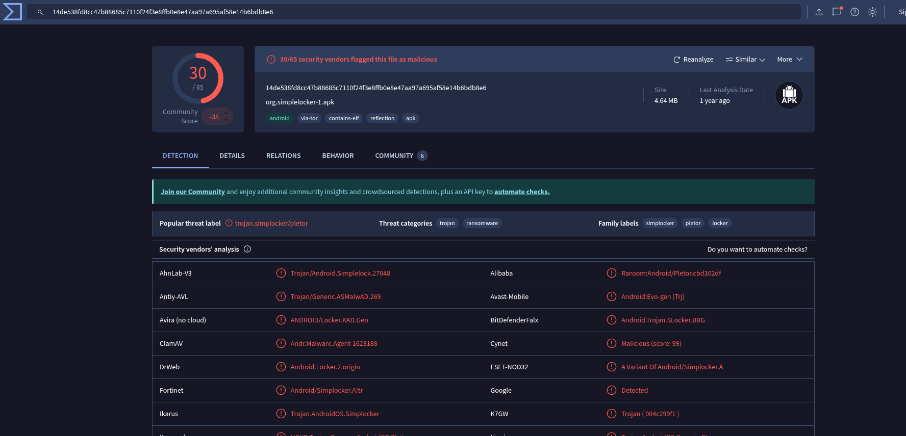
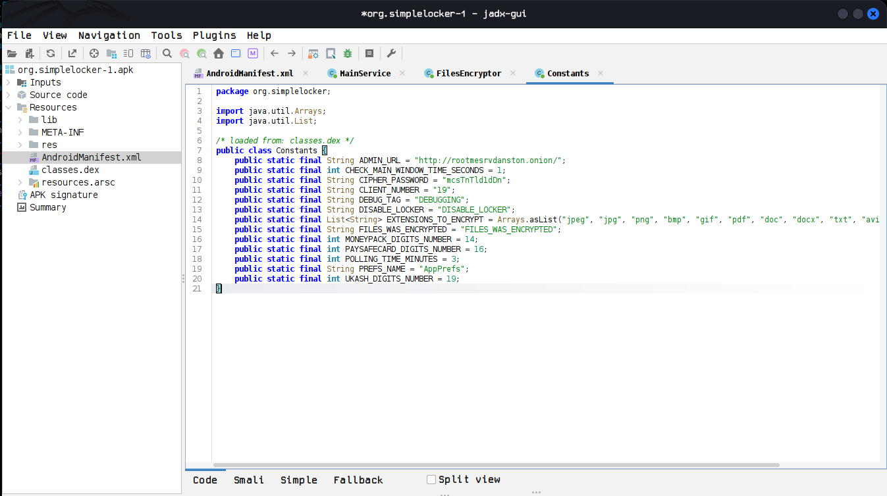

# [Ransomware Android](https://www.root-me.org/en/Challenges/Forensic/Ransomware-Android)

***Statement: 
The CISO’s Android tablet has been compromised by a ransomware: his confidential documents have been encrypted. It is out of the question to pay any ransom whatsoever to these filthy hackers!
You have a partial dump of his tablet and must restore these valuable documents.***

**WARNING : this challenge contains a malware. Don't try to execute or debug any binaries on your own machine. The ZIP archive is protected with the password "infected".**

- Download the attachment and unzip it using the above password.
```
ls
Android-dump  ch10.zip
```
- navigate through the directory.
- I found a image file at **/Android-dump/media/Documents** 
```
ls
Confidentiel.jpg.enc
```
- But the file is encrypted, let's try to recover it. 
- Inside **Android-dump/app** directory i found an apk file
```
Android-dump/app ❯ tree
.
└── org.simplelocker-1.apk

1 directory, 1 file 
```
- Seems this is the malicious Ransomware file. I uploaded it to Virustotal to confirm. 

## Static analysis 

- Let's try to decompile the file and analyze the source code. I am going to use a tool called **jadx**
***open-source tool that decompiles APKs, DEX, and JAR files directly into readable Java source code. It provides a graphical interface, making it easy to navigate application structures and search for sensitive information during analysis.***
- Installation
- Download the zip file from the [github](https://github.com/skylot/jadx/releases/tag/v1.5.3)
```
sudo unzip jadx-1.5.3.zip -d /opt/jadx-1.5.3                                                             ✘ INT
[sudo] password for light: 
Archive:  jadx-1.5.3.zip
  inflating: /opt/jadx-1.5.3/README.md  
  inflating: /opt/jadx-1.5.3/LICENSE  
   creating: /opt/jadx-1.5.3/bin/
  inflating: /opt/jadx-1.5.3/bin/jadx-gui  
  inflating: /opt/jadx-1.5.3/bin/jadx-gui.bat  
  inflating: /opt/jadx-1.5.3/bin/jadx  
  inflating: /opt/jadx-1.5.3/bin/jadx.bat  
   creating: /opt/jadx-1.5.3/lib/
  inflating: /opt/jadx-1.5.3/lib/jadx-1.5.3-all.jar  
```
- start the GUI version
```
./jadx-gui 
```
- Upload the apk file and start analysis.
- In the AndroidManifest.xml file, you can see the Details about the apk.
- Permissions
```
<uses-permission android:name="android.permission.INTERNET"/>
    <uses-permission android:name="android.permission.ACCESS_NETWORK_STATE"/>
    <uses-permission android:name="android.permission.READ_PHONE_STATE"/>
    <uses-permission android:name="android.permission.RECEIVE_BOOT_COMPLETED"/>
    <uses-permission android:name="android.permission.WAKE_LOCK"/>
    <uses-permission android:name="android.permission.WRITE_EXTERNAL_STORAGE"/>
    <uses-permission android:name="android.permission.READ_EXTERNAL_STORAGE"/>
```
- App starts automatically after reboot.
- Using Tor network connections, disable system backup and all. 
- From the AndroidManifest.xml i found a Java class called **MainService**
```
  </receiver>
        <service android:name="org.simplelocker.MainService"/>
        <service
```
- Double-click on the MainService. Then a newtab opens with the source code. 
- Inside the source code, we can see a **FilesEncryptor()** function. 
```
                    FilesEncryptor encryptor = new FilesEncryptor(MainService.this.context);
                    encryptor.encrypt();
                } catch (Exception e) {
                    Log.d(Constants.DEBUG_TAG, "Error: " + e.getMessage());
                }
```
- Double-click on it to open the function in a new tab.
- Inside FileEncryptor() we can find a variable name     
```
public void encrypt() throws Exception {
        if (!this.settings.getBoolean(Constants.FILES_WAS_ENCRYPTED, false) && isExternalStorageWritable()) {
            AesCrypt aes = new AesCrypt(Constants.CIPHER_PASSWORD);
            Iterator<String> it = this.filesToEncrypt.iterator();
            while (it.hasNext()) {
                String fileName = it.next();
                aes.encrypt(fileName, String.valueOf(fileName) + ".enc");
                File file = new File(fileName);
                file.delete();
            }
            Utils.putBooleanValue(this.settings, Constants.FILES_WAS_ENCRYPTED, true);
        }
    }
```
- The functions encrypt files and delete the originals.
- It uses Aes encryption to encrypt the files. It stores the password in **Constants.CIPHER_PASSWORD**
- Double click on it to see in the constants class, we can find the key

- **key: mcsTnTld1dDn**
- Lets Decrypt the file. I am going to use python module pycryptodome.
```
#!/usr/bin/env python3

import sys
from pathlib import Path
from Crypto.Cipher import AES
from Crypto.Hash import SHA256
from Crypto.Util.Padding import unpad


PASSWORD = "mcsTnTld1dDn"
BLOCK_SIZE = 16


def derive_key(password: str) -> bytes:
    
    return SHA256.new(password.encode()).digest()


def decrypt_file(input_path: Path, output_path: Path) -> None:
    
    key = derive_key(PASSWORD)
    iv = b"\x00" * BLOCK_SIZE  # Static IV (as observed)

    try:
        with input_path.open("rb") as f:
            encrypted_data = f.read()

        cipher = AES.new(key, AES.MODE_CBC, iv)
        decrypted_data = cipher.decrypt(encrypted_data)

       
        try:
            decrypted_data = unpad(decrypted_data, BLOCK_SIZE)
        except ValueError:
            
            pass

        with output_path.open("wb") as f:
            f.write(decrypted_data)

        print(f"[+] Decryption successful: {output_path}")

    except Exception as e:
        print(f"[!] Error during decryption: {e}")
        sys.exit(1)


def main():
    if len(sys.argv) != 3:
        print(f"Usage: {sys.argv[0]} <encrypted_file> <output_file>")
        sys.exit(1)

    input_file = Path(sys.argv[1])
    output_file = Path(sys.argv[2])

    if not input_file.exists():
        print("[!] Input file does not exist.")
        sys.exit(1)

    decrypt_file(input_file, output_file)


if __name__ == "__main__":
    main()
```

```
python3 dec.py Android-dump/media/Documents/Confidentiel.jpg.enc Confidentiel.jpg                           py_venv
[+] Decryption successful: Confidentiel.jpg
```


- **password:  BullShitR4ns0mW4re**
