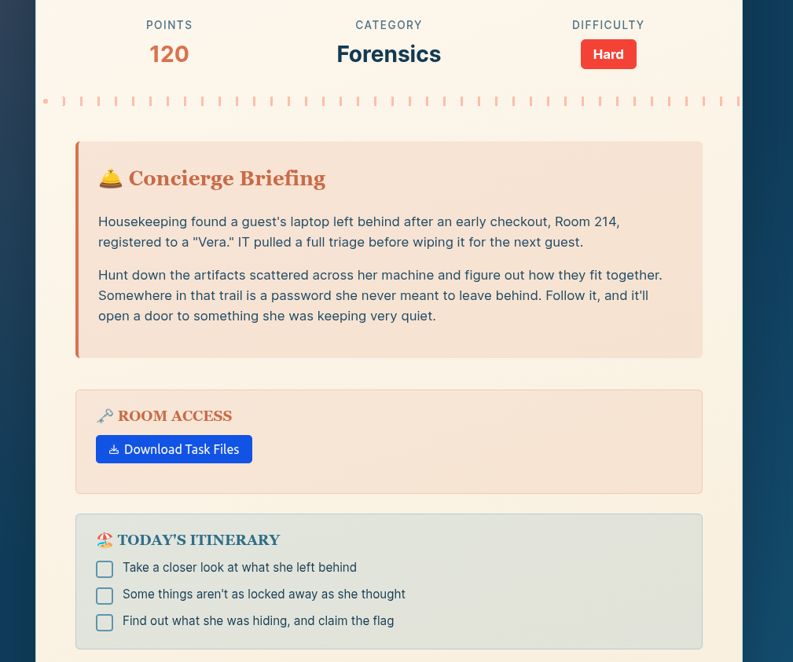
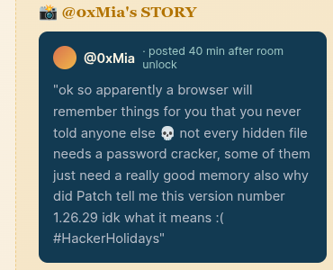
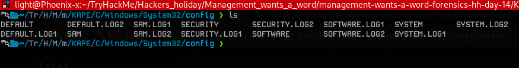
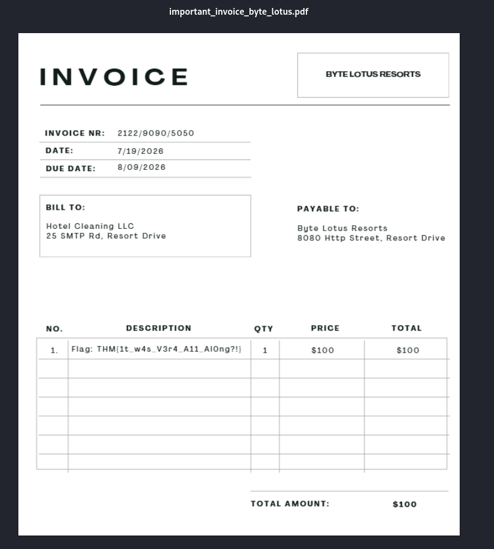
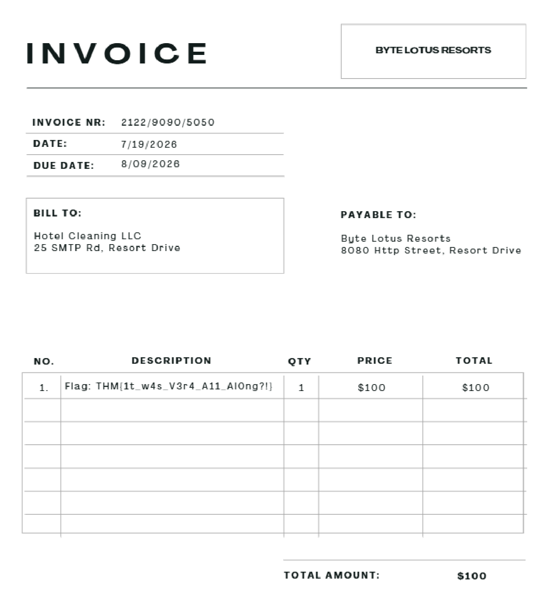

# [Management Wants a Word](https://tryhackme.com/room/hh-managementwantsaword-6bf3cc41)

- Day 14 of Hacker Holidays
- This is a forensic lab.



- Let's download the attachment and start our investigation.



- Download the attachment and unzip it.

```
 ls -all
total 223780
drwxrwxr-x 3 light light      4096 Aug 10 17:31 .
drwxrwxr-x 8 light light      4096 Aug 10 15:24 ..
drwxrwxrwx 3 light light      4096 Aug  4 14:19 management-wants-a-word-forensics-hh-day-14
-rw-rw-r-- 1 light light 229133449 Aug 10 15:44 management-wants-a-word-forensics-hh-day-14-1785854680266.zip
```
- We have a KAPE dump. A KAPE dump typically refers to a triage data collection or forensic image created using KAPE `(Kroll Artifact Parser and Extractor)`, an efficient incident response tool by Kroll and Eric Zimmerman. It extracts vital forensic artifacts (like registry hives, event logs, and prefetch files) from a live or mounted Windows system.
- The post by @oxMia looks very interesting. It seems like we have to extract some creds from a browser's local storage or something. I don't know exactly, but what I know is that we have to investigate the browser's local data.
- Let's start our investigation.
- If we navigate to the users directory, we can see a user called `vera`.
- If we go to the `KAPE/C/Users/vera/AppData/Local/Google/`, we can see a `chrome for testing` folder. Inside it, you can find `user data`.
- This is Chrome browser's user data. Let's start our investigation from the history.
- The Chrome history is stored in `../Default/History`, which is a SQLite file.

```
cp History /tmp/hist.db

sqlite3 hist.db 
SQLite version 3.46.1 2024-08-13 09:16:08
Enter ".help" for usage hints.
sqlite> .tables
cluster_keywords          downloads                 segment_usage           
cluster_visit_duplicates  downloads_slices          segments                
clusters                  downloads_url_chains      urls                    
clusters_and_visits       history_sync_metadata     visit_source            
content_annotations       keyword_search_terms      visited_links           
context_annotations       meta                      visits     
```
- Let's see his browser history.

```
sqlite> select url,title from urls;

http://bytelotus.thm:8080/|SecureVault Portal
http://bytelotus.thm:8080/login|Error response
https://www.google.com/search?q=chrome+cves&oq=chrome+cves&gs_lcrp=EgZjaHJvbWUyBggAEEUYOTIICAEQABgWGB4yDQgCEAAYhgMYgAQYigUyBwgDEAAY7wUyBwgEEAAY7wUyBwgFEAAY7wUyBwgGEAAY7wUyCggHEAAYgAQYogTSAQgxOTU0ajBqN6gCCLACAQ&sourceid=chrome&ie=UTF-8|chrome cves - Google Search
https://www.google.com/search?q=chrome+cves&oq=chrome+cves&gs_lcrp=EgZjaHJvbWUyBggAEEUYOTIICAEQABgWGB4yDQgCEAAYhgMYgAQYigUyBwgDEAAY7wUyBwgEEAAY7wUyBwgFEAAY7wUyBwgGEAAY7wUyCggHEAAYgAQYogTSAQgxOTU0ajBqN6gCCLACAQ&sourceid=chrome&ie=UTF-8&sei=opRdavifJ_SEmLQP45Wd4QM|chrome cves - Google Search
https://www.google.com/search?q=how+to+exfiltrate+data+red+teaming&oq=how+to+exfiltrate+data+red+teaming&gs_lcrp=EgZjaHJvbWUyBggAEEUYOTIHCAEQIRigATIHCAIQIRigAdIBCTE4NzI3ajBqN6gCCLACAQ&sourceid=chrome&ie=UTF-8|how to exfiltrate data red teaming - Google Search
https://www.google.com/search?q=tryhackme&oq=tryhack&gs_lcrp=EgZjaHJvbWUqDwgAEAAYQxixAxiABBiKBTIPCAAQABhDGLEDGIAEGIoFMgYIARBFGDkyDAgCEAAYQxiABBiKBTIMCAMQABhDGIAEGIoFMgcIBBAAGIAEMgcIBRAAGIAEMgcIBhAAGIAEMgcIBxAAGIAEMgcICBAAGIAEMgcICRAAGIAEqAIAsAIA&sourceid=chrome&ie=UTF-8|tryhackme - Google Search
```
- He visited the `http://bytelotus.thm:8080/|SecureVault Portal` SecureVault portal.
- The Google URLs contain hints: `chrome cves` and `how to exfiltrate data red teaming`. So, user Vera searched for data exfiltration techniques.
- Maybe, as the lab description says, `Somewhere in that trail is a password she never meant to leave behind`, we have to find the password for this secret vault to get the flag.
- But where is the vault?
- In the `/vera/Documents/` directory, I found a file called `backup`, but I don't know what it is.

```
exiftool backup 

ExifTool Version Number         : 13.55
File Name                       : backup
Directory                       : .
File Size                       : 105 MB
File Modification Date/Time     : 2026:08:04 14:15:52+05:30
File Access Date/Time           : 2026:08:11 14:15:39+05:30
File Inode Change Date/Time     : 2026:08:10 17:31:59+05:30
File Permissions                : -rw-rw-rw-
Error                           : Unknown file type
```
- The absence of magic bytes, VeraCrypt headers being fully encrypted by design, and high entropy indicating a strong encryption algorithm indicate that this is a `VeraCrypt volume`.
- Vera tried to log in to a SecureVault via the browser. Chrome stores login passwords and secrets in the `Login Data` SQLite database.

```
User Data/Default ❯ cp Login\ Data /tmp/logindt.db
```
```
/tmp ❯ sqlite3 logindt.db 
SQLite version 3.46.1 2024-08-13 09:16:08
Enter ".help" for usage hints.
sqlite> .tables
insecure_credentials    password_notes          sync_model_metadata   
logins                  stats                 
meta                    sync_entities_metadata

sqlite> select * from logins;
http://bytelotus.thm:8080/|http://bytelotus.thm:8080/login|username|VeraSecretVault|password|v10Ȋr�O5�>�>���Jhp�k
            �F�unڈ��$����o��Zĉa��2L�px���||http://bytelotus.thm:8080/|13428975215439463|0|0|0|0|$||||0|0||1|13428975210866617||13428975215439869|||0|0||
```
- As you can see, the password was there, but it is encrypted. We need to decrypt it.
- The prefix identifies the Chrome encrypted-data format/version. `v10` means the password is encrypted with AES-256.

- **Here is the flowchart for decrypting the password:**

```
┌───────────────────────────────────────────────┐
│  1. Chrome "Login Data"                       │
│                                               │
│  Location:                                    │
│  %LOCALAPPDATA%\Google\Chrome\User Data\      │
│  <Profile>\Login Data                         │
│                                               │
│  Table: logins                                │
│  Column: password_value                       │
│                                               │
│  Example:                                     │
│  v10 <encrypted password bytes>               │
└───────────────────────┬───────────────────────┘
                        │
                        │ Need Chrome's
                        │ encryption key
                        ▼
┌───────────────────────────────────────────────┐
│  2. Chrome "Local State"                      │
│                                               │
│  Location:                                    │
│  %LOCALAPPDATA%\Google\Chrome\User Data\      │
│  Local State                                  │
│                                               │
│  Contains Chrome's encrypted key material     │
│  (commonly under: os_crypt                    │
│  / encrypted_key on Windows)                  │
└───────────────────────┬───────────────────────┘
                        │
                        │ encrypted_key is
                        │ protected by Windows
                        ▼
┌───────────────────────────────────────────────┐
│  3. Windows DPAPI                             │
│                                               │
│  DPAPI-protected Chrome key                   │
│              ↓                                │
│  Windows user-specific DPAPI protection       │
└───────────────────────┬───────────────────────┘
                        │
                        │ Need DPAPI
                        │ master-key material
                        ▼
┌───────────────────────────────────────────────┐
│  4. DPAPI Master Keys                         │
│                                               │
│  Typical user-profile location:               │
│                                               │
│  %APPDATA%\Microsoft\Protect\<User-SID>\      │
│                                               │
│  Contains DPAPI master-key files              │
│  (GUID-named files)                           │
└───────────────────────┬───────────────────────┘
                        │
                        │ Need the material that
                        │ allows DPAPI master-key
                        │ recovery
                        ▼
┌───────────────────────────────────────────────┐
│  5. Windows user credential / DPAPI context   │
│                                               │
│  Relevant artifacts can include:              │
│                                               │
│  • User's Windows credential material         │
│  • User profile                               │
│  • SAM registry hive                          │
│  • SYSTEM registry hive                       │
│  • Domain backup-key material, when relevant  │
│                                               │
│  Locations in a forensic image include:       │
│                                               │
│  C:\Windows\System32\config\SYSTEM            │
│  C:\Windows\System32\config\SAM               │
│                                               │
│  plus the user's profile and Protect folder   │
└───────────────────────┬───────────────────────┘
                        │
                        ▼
              ┌──────────────────┐
              │ DPAPI can unlock │
              │ master-key data  │
              └────────┬─────────┘
                       │
                       ▼
              Chrome encryption key
                       │
                       ▼
              decrypt password_value
                       │
                       ▼
                 Plaintext
                 credential
```
- First, we need the DPAPI master key. For that, we need the Windows user credentials.

- For that, we need two files, `SAM` and `SYSTEM`. You can find them in `/windows/system32/config`.



```
impacket-secretsdump -sam SAM -system SYSTEM LOCAL
Impacket v0.14.0.dev0 - Copyright Fortra, LLC and its affiliated companies 

[*] Target system bootKey: 0x0f6f73ce89c8cda52d06fcc5131e040f
[*] Dumping local SAM hashes (uid:rid:lmhash:nthash)
Administrator:500:aad3b435b51404eeaad3b435b51404ee:1241186a4aac4f34f4bf7ace71b396a8:::
Guest:501:aad3b435b51404eeaad3b435b51404ee:31d6cfe0d16ae931b73c59d7e0c089c0:::
DefaultAccount:503:aad3b435b51404eeaad3b435b51404ee:31d6cfe0d16ae931b73c59d7e0c089c0:::
WDAGUtilityAccount:504:aad3b435b51404eeaad3b435b51404ee:1961c38510b8e33fcdb1879616d12dfc:::
vera:1000:aad3b435b51404eeaad3b435b51404ee:1241186a4aac4f34f4bf7ace71b396a8:::
[*] Cleaning up... 
```
- We got some hashes. Let's try to crack Vera's credentials. Save the hash to a file and feed it to John or Hashcat.

```
echo 'vera:1000:aad3b435b51404eeaad3b435b51404ee:1241186a4aac4f34f4bf7ace71b396a8:::' > hashes.txt
```
```
~/TryHackMe/Hackers_holiday/Management_wants_a_word ❯ john hashes.txt --wordlist=/usr/share/wordlists/rockyou.txt --format=NT
Using default input encoding: UTF-8
Loaded 1 password hash (NT [MD4 256/256 AVX2 8x3])
Warning: no OpenMP support for this hash type, consider --fork=16
Press 'q' or Ctrl-C to abort, almost any other key for status
minivera         (vera)     
1g 0:00:00:01 DONE (2026-08-10 18:16) 0.6711g/s 3697Kp/s 3697Kc/s 3697KC/s minizito..minitindel
Use the "--show --format=NT" options to display all of the cracked passwords reliably
Session completed. 
```
- **vera:minivera**

- Now we have the user creds. Let's reconstruct the **DPAPI** master key.
- Windows derives DPAPI operational key values by running an encryption routine combining the user’s password with their specific Security Identifier (SID).
- For this, we need the `SID` and `Master key`, which can be found under `./Users/vera/AppData/Roaming/Microsoft/Protect/<SID>/`.

- **Generating the DPAPI MASTER KEY**

```
 impacket-dpapi masterkey -file "c90719ef-5b98-474e-b934-136d606a702a" -sid "S-1-5-21-2529683458-431225740-1723070931-1000" -password minivera
```
```
Impacket v0.14.0.dev0 - Copyright Fortra, LLC and its affiliated companies 

[MASTERKEYFILE]
Version     :        2 (2)
Guid        : c90719ef-5b98-474e-b934-136d606a702a
Flags       :        5 (5)
Policy      :        0 (0)
MasterKeyLen: 000000b0 (176)
BackupKeyLen: 00000090 (144)
CredHistLen : 00000014 (20)
DomainKeyLen: 00000000 (0)

Decrypted key with User Key (SHA1)
Decrypted key: 0x5e5715ec9b6df5a86e97902692a66d28e691f05d5bc1e04d0159cfe960e94c978c07e5004a0179d3a96df2468885a28175b0b02cc064445f116a752d2b3e9d40
```
- Now, using the `DPAPI key`, we can recover the Chrome app master key from the Base64 encryption key blob found in the JSON-formatted `LOCAL STATE` config file.
- With the help of ChatGPT, I wrote this Python script to extract the encryption key blob.

```
import json
import base64

with open("../User Data/Local State", "r", encoding="utf-8") as f:
    ls = json.load(f)

raw = base64.b64decode(ls["os_crypt"]["encrypted_key"])

print(f"Decoded length: {len(raw)} bytes")
print(f"Prefix: {raw[:5]!r}")
print(f"Hex: {raw[:16].hex(' ')}")

if raw[:5] == b"DPAPI":
    dpapi_blob = raw[5:]

    with open("/tmp/chrome_key_blob.bin", "wb") as f:
        f.write(dpapi_blob)

    print(f"[+] DPAPI prefix removed")
    print(f"[+] DPAPI blob: {len(dpapi_blob)} bytes")
else:
    print("[-] Expected DPAPI prefix was not found")
    print("[!] Do not strip the first 5 bytes blindly.")
```
```
python3 chrome_master_key_decrypt.py 
Decoded length: 317 bytes
Prefix: b'DPAPI'
Hex: 44 50 41 50 49 01 00 00 00 d0 8c 9d df 01 15 d1
[+] DPAPI prefix removed
[+] DPAPI blob: 312 bytes
```
- Now, decrypting the `Chrome key` using the extracted `DPAPI master key`

```
impacket-dpapi unprotect -file chrome_key_blob.bin -key 0x5e5715ec9b6df5a86e97902692a66d28e691f05d5bc1e04d0159cfe960e94c978c07e5004a0179d3a96df2468885a28175b0b02cc064445f116a752d2b3e9d40
```
```
Impacket v0.14.0.dev0 - Copyright Fortra, LLC and its affiliated companies 

Successfully decrypted data
 0000   20 6A 39 A0 97 13 27 EA  94 87 E4 AE A9 84 4F 5D    j9...'.......O]
 0010   36 70 16 24 56 98 22 76  93 9A 71 26 46 DA 0B 02   6p.$V."v..q&F...
```

- **Decrypted Chrome AES-256 KEY:** `206a39a0971327ea9487e4aea9844f5d3670162456982276939a712646da0b02`

```
sqlite3 /tmp/logindt.db "SELECT origin_url, username_value, hex(password_value) FROM logins;"
http://bytelotus.thm:8080/|VeraSecretVault|763130C88A72A64F35F63E883EA0A7F64A6870E46B0BBB469A756EDA88B7E324C3E1C51015AA6FD8D65AC48961E1EA324CE1707807FEB3D7
```

- **Decrypting the VeraSecretVault password**
- For a v10 Chrome credential, the usual layout is: `v10 | 12-byte nonce | ciphertext | 16-byte GCM authentication tag`
- We can use AES-256-GCM to decrypt it. I used this Python script to do that.

```
from cryptography.hazmat.primitives.ciphers.aead import AESGCM

key = bytes.fromhex(
    "206a39a0971327ea9487e4aea9844f5d3670162456982276939a712646da0b02"
)

encrypted = bytes.fromhex(
    "763130C88A72A64F35F63E883EA0A7F64A6870E46B0BBB469A756EDA88B7E324C3E1C51015AA6FD8D65AC48961E1EA324CE1707807FEB3D7"
)

assert encrypted[:3] == b"v10"

nonce = encrypted[3:15]
ciphertext_and_tag = encrypted[15:]

plaintext = AESGCM(key).decrypt(
    nonce,
    ciphertext_and_tag,
    None
)

print(plaintext.decode("utf-8"))
```
```
python3 vault_pass_decry.py 

Wh4t1sV3raD0inG0nTh1sH0st
```
- **Vault Password: Wh4t1sV3raD0inG0nTh1sH0st**
- Navigate to `/vera/Documents/` and rename the backup file to `backups.vc`.

```
cp backup /tmp/backup.vc
```
- Modern cryptsetup has support for TrueCrypt/VeraCrypt-compatible volumes through its `open --type tcrypt` functionality. So you don't necessarily need the standalone VeraCrypt application just to open a compatible container.

```
sudo cryptsetup open --type tcrypt backup.vc backup  
Enter passphrase for backup.vc: 
```
- Now, mount the decrypted volume.

```
mkdir -p /mnt/vault

sudo mount /dev/mapper/backup /mnt/vault

cd /mnt/vault
```

- Inside the volume, we can find a `secret_financial_documents` directory.

```

ls
'$RECYCLE.BIN'  'System Volume Information'   secret_financial_documents
/mnt/vault ❯ cd secret_financial_documents 
/mnt/vault/secret_financial_documents ❯ ls
important_invoice_byte_lotus.pdf  transactions_q3.csv
```


- I can see the flag in the PDF file, but it is not working. What is next?
- If you closely inspect the `CSV` file, you can find out where to look for the flag.

```
cat transactions_q3.csv 
Date,Reference,Vendor,Description,Amount,Status
2026-07-02,TXN-10481,Byte Lotus Catering,Staff refreshments,842.16,Approved
2026-07-05,TXN-10493,Sunrise Transport,Airport transfers,1260.00,Approved
2026-07-09,TXN-10514,Lotus Printworks,Event materials,418.75,Approved
2026-07-12,TXN-10531,Internal Adjustment,Image asset correction,0.00,Archived
2026-07-15,TXN-10547,Byte Lotus Resorts,Guest accommodation,3840.00,Approved%  
```

- Take a look at the line `2026-07-12,TXN-10531,Internal Adjustment,Image asset correction,0.00,Archived`. This is the hint: we are looking for an image file, and it is archived.
- Standard textual search applications like grep or pdftotext miss matching entries within the target PDF because the financial document was stored entirely as an embedded raster graphics block (XObject/Image).
- We must unpack the underlying visual vector manually using mutool to render it cleanly:

```
mutool draw -r 200 -o /tmp/invoice.png important_invoice_byte_lotus.pdf
```


- I am so exhausted, so I uploaded the image to Gemini AI to extract the flag for me, and it did.

**Flag: THM{1t_w4s_V3r4_A11_Al0ng?!}**