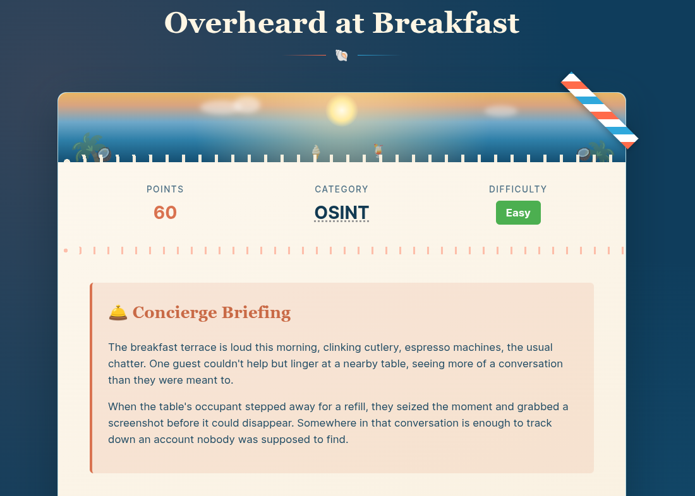
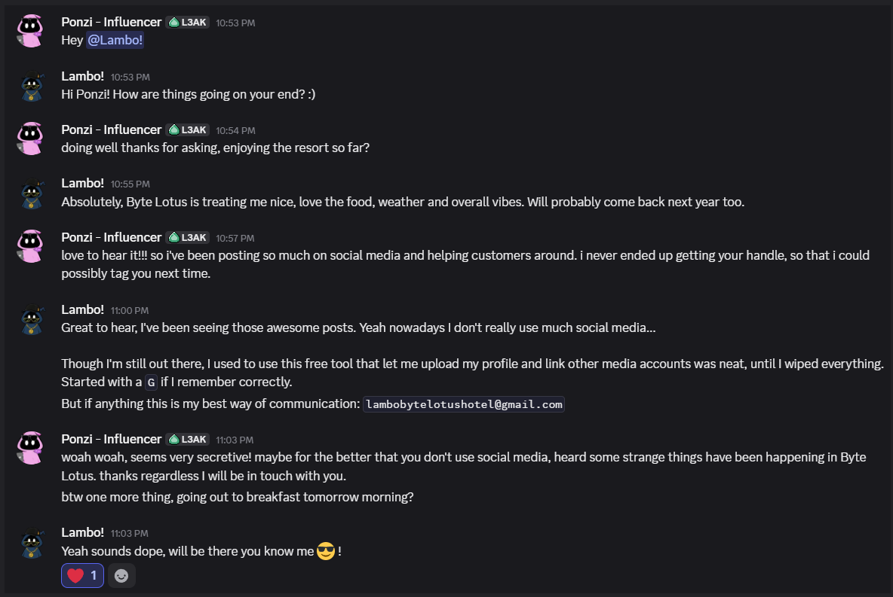
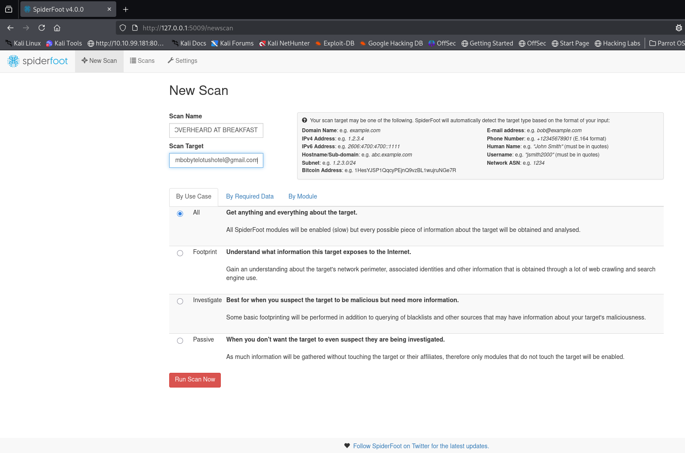
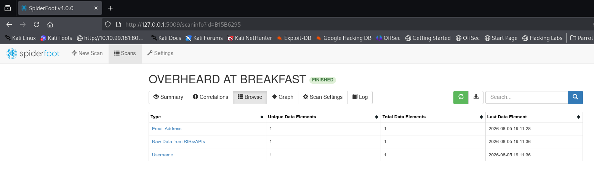
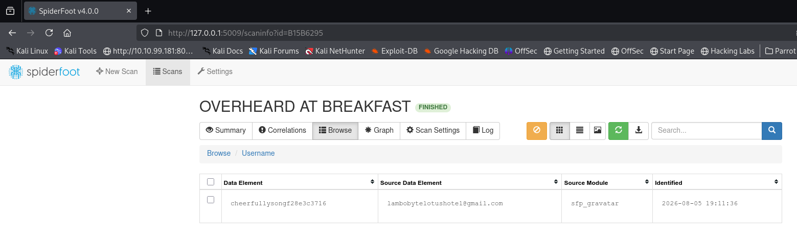
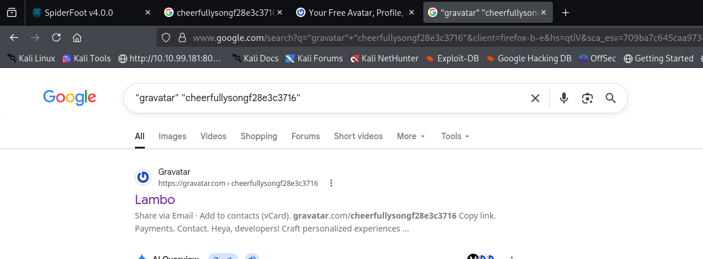
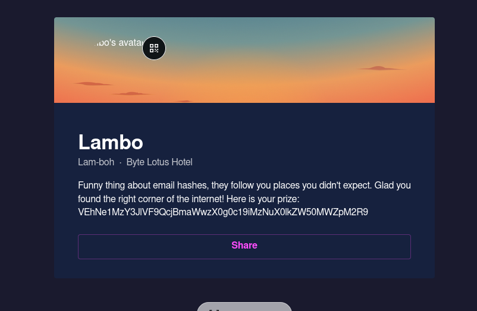

# [Overheard at Breakfast](https://tryhackme.com/room/hh-overheardatbreakfast-6f01793c)

* Day 6 of Hacker Holidays 2026.
* It is an OSINT lab where we have to find a hidden account.



* Download the attachment and unzip it.

```
unzip overheard-at-breakfast-1784259780309.zip 
Archive:  overheard-at-breakfast-1784259780309.zip
replace conversation.png? [y]es, [n]o, [A]ll, [N]one, [r]ename: y
  inflating: conversation.png    
```

* We got an image file. Let's see what it is.



* It is a conversation between two parties. They are talking about a social media account, and all we have is an email address.
* Now we have to find the social media account associated with the email.
* **Email:** `lambobytelotushotel@gmail.com`
* There are lots of OSINT tools and online services available to do this task, but I am going to use a tool called **SpiderFoot**. It is available in the Kali Linux repositories.
* If you want to know more about the tool, visit its [GitHub page](https://github.com/smicallef/spiderfoot).
* Start the tool.

```
spiderfoot -l 127.0.0.1:5009                                                                                                                                                                             4s
/usr/lib/python3/dist-packages/adblockparser/parser.py:247: SyntaxWarning: invalid escape sequence '\w'
  rule = rule.replace("^", "(?:[^\w\d_\-.%]|$)")
/usr/lib/python3/dist-packages/adblockparser/parser.py:272: SyntaxWarning: invalid escape sequence '\|'
  rule = re.sub("(\|)[^$]", r"\|", rule)

*************************************************************
 Use SpiderFoot by starting your web browser of choice and 
 browse to http://127.0.0.1:5009/
*************************************************************
```

* Visit the URL in your browser.
* Click on **New Scan**, enter any scan name, and provide the email as the scan target.



* Click **Run Scan**.
* In the **Browse** tab, you will see the different types of information gathered about the email. You can see a **Username** entry, which is what we are interested in.





* From the above screenshot, we can see that the username belongs to a platform called **Gravatar**.
* So I used the following search query on Google:

```
"gravatar" "cheerfullysongf28e3c3716"
```





* Copy the Base64 data from the user bio and decode it.

```
echo "VEhNe1MzY3JlVF9QcjBmaWwzX0g0c19iMzNuX0lkZW50MWZpM2R9" | base64 -d
THM{S3creT_Pr0fil3_H4s19iMzNuX0lkZW50MWZpM2R9}
```

**Flag:** `THM{S3creT_Pr0fil3_H4s_b33n_Ident1fi3d}`
