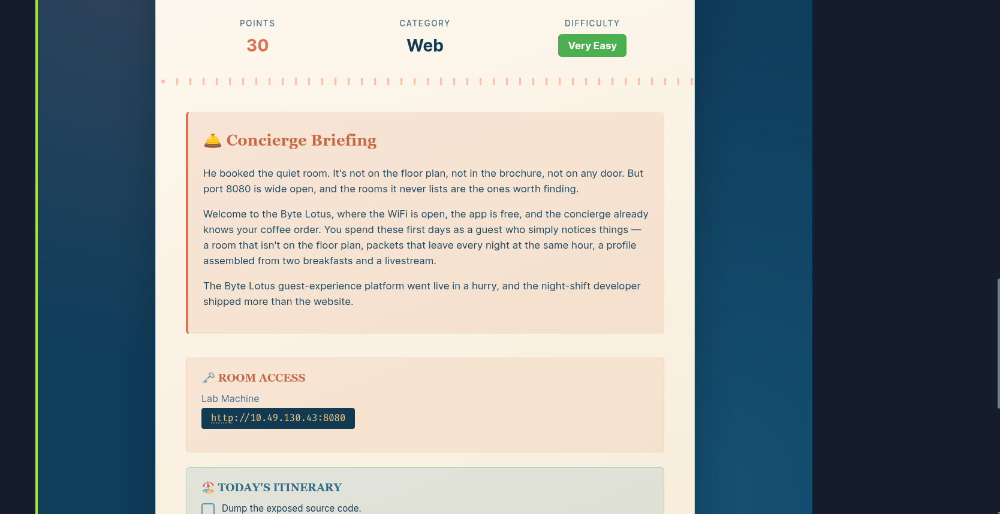
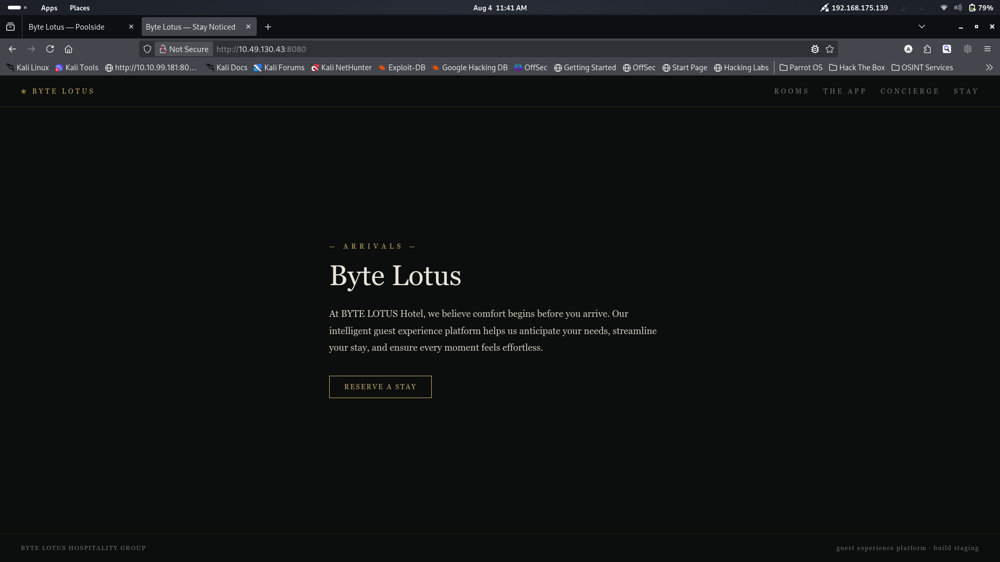
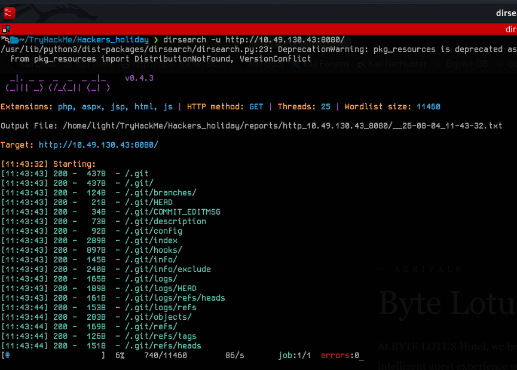
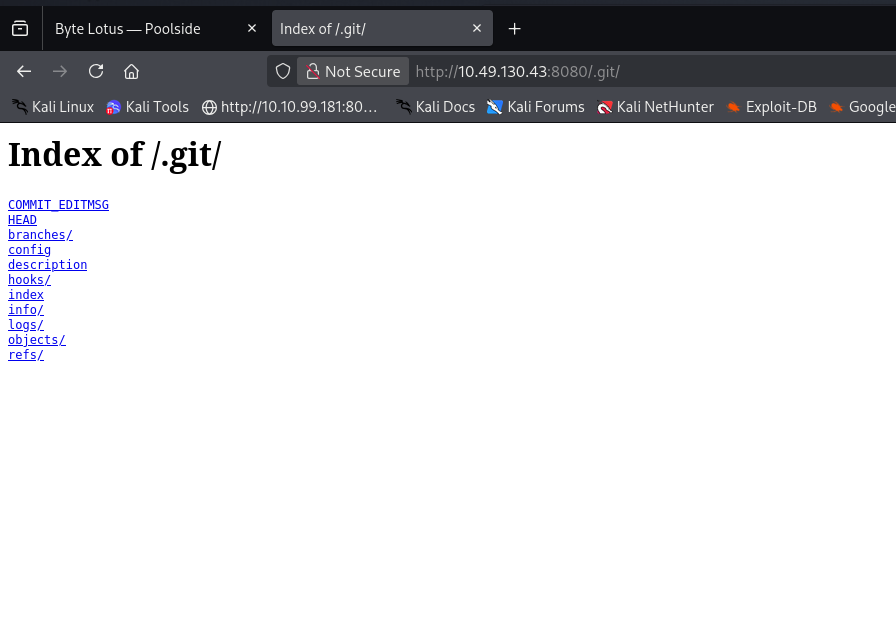
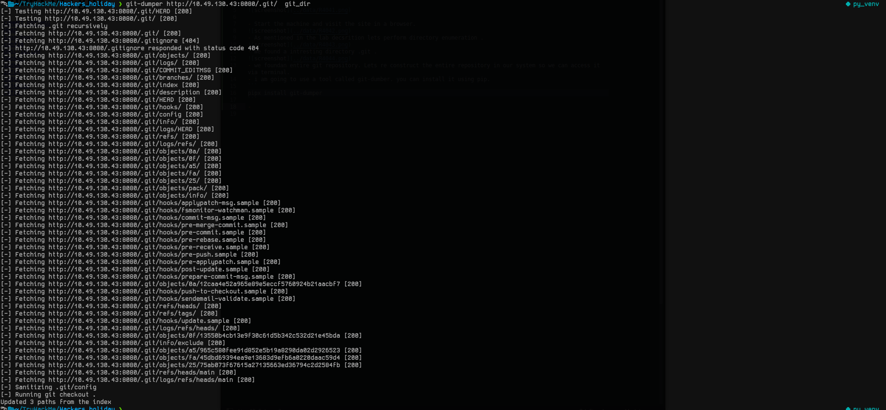
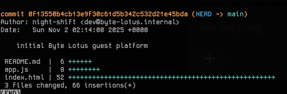
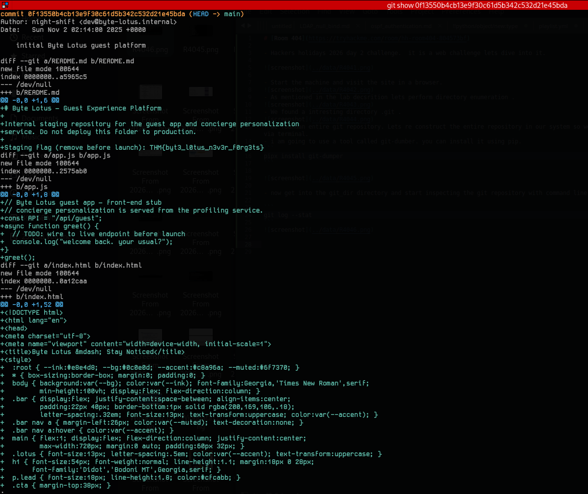

# [Room 404](https://tryhackme.com/room/hh-room404-804573bf)

- Hackers Holidays 2026 day 2 challenge.  It is a web challenge; let's dive into it.



- Start the machine and visit the site in a browser.
  


- As mentioned in the lab description, let's perform directory enumeration. 


- We found an interesting directory, .git. 



- We found an entire git repository. Let's reconstruct the entire repository in our system so we can access it via terminal.
- I am going to use a tool called git-dumper. You can install it using pip.

```
pipx install git-dumper
```
```
git-dumper http://10.49.130.43:8080/.git/  git_dir
```


- Now get into the git_dir directory and start inspecting the git repository with the command line.

```
git log --stat
```
- This shows the metadata and a summary of which files were modified and how many lines changed.
  


- Copy the hash and use the command below
```
git show <hash>
```
- To see the author, date, full commit message, and the exact code changes (diff) for a specific commit.
  


- From the screenshot above, we can see that the file Readme.md initially contains the flag, but later it was removed.

**Flag: THM{byt3_l0tus_n3v3r_f0rg3ts}**
