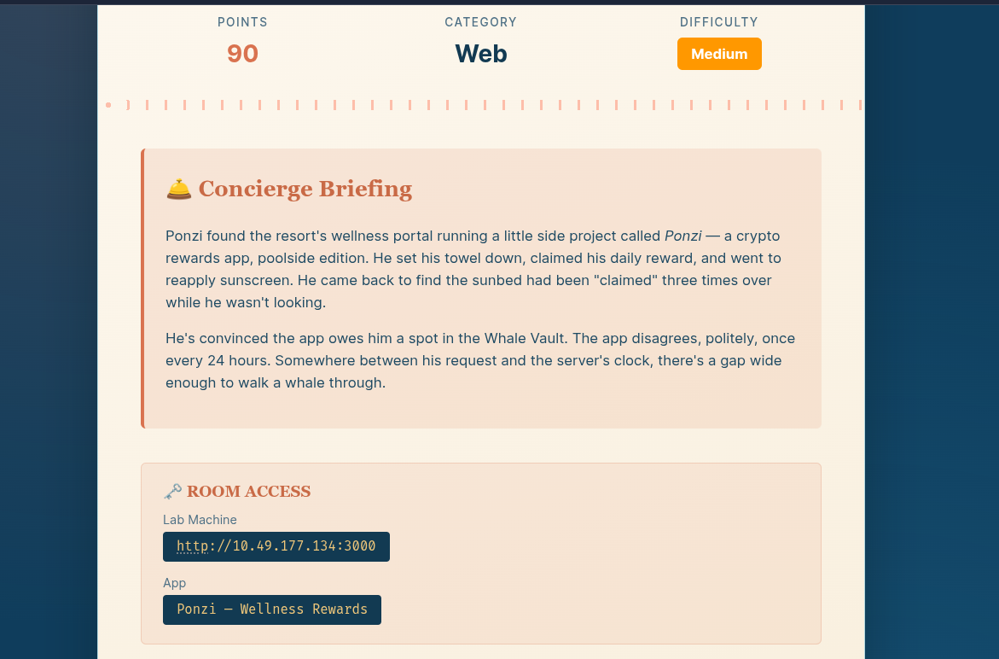
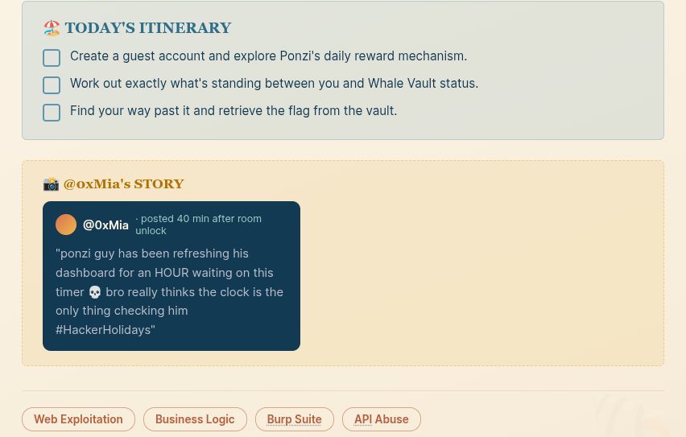
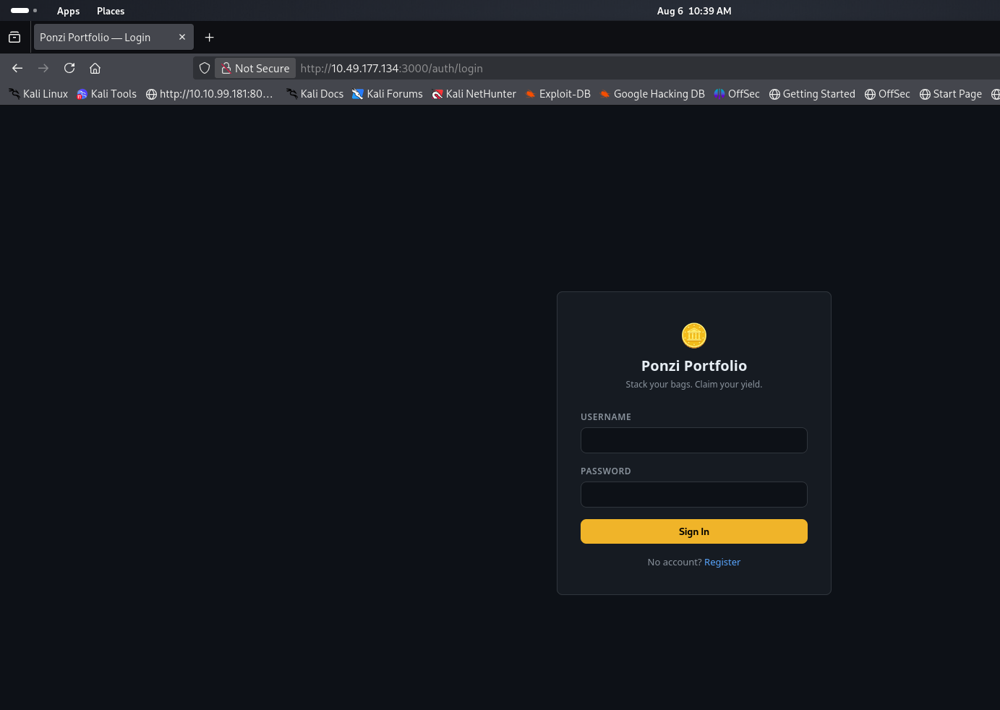
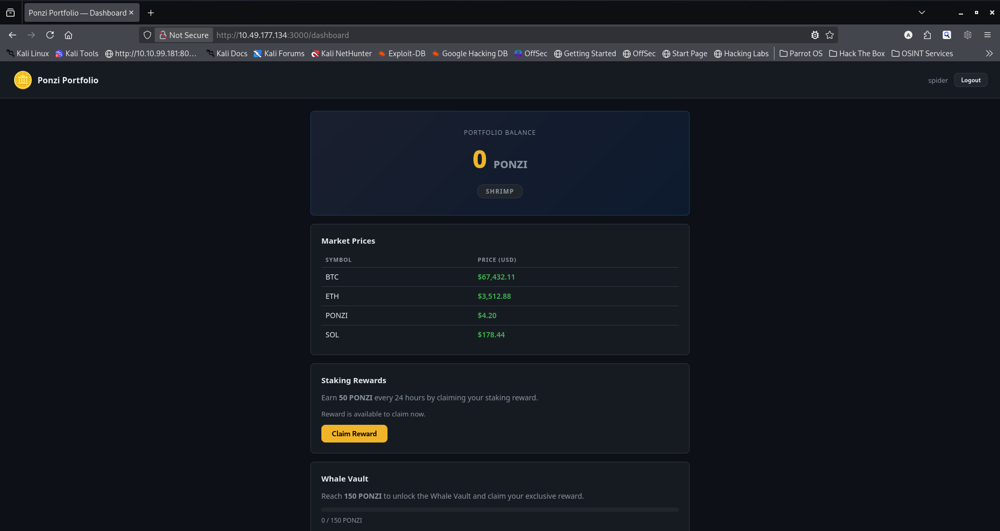
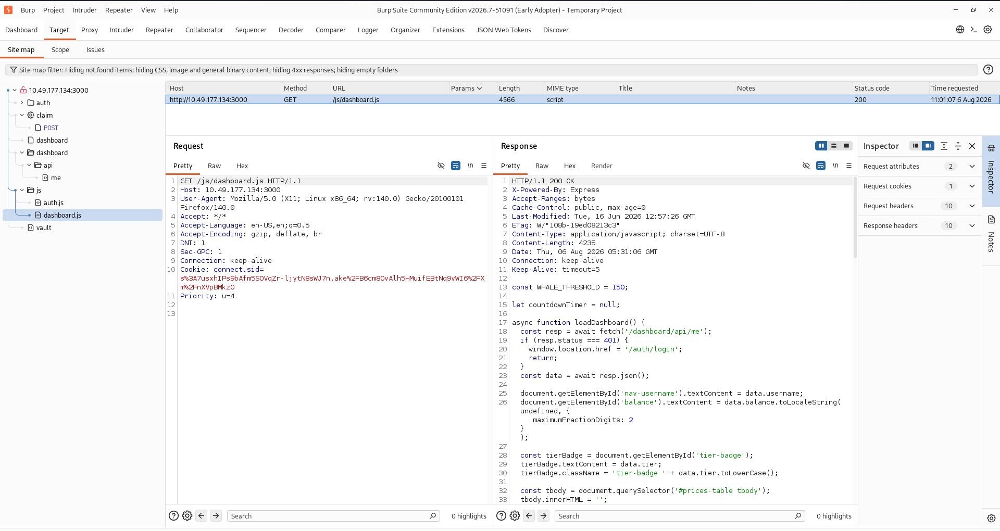
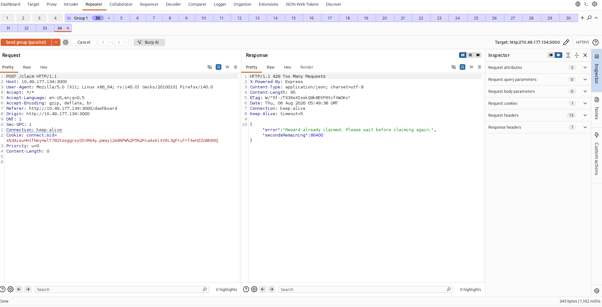
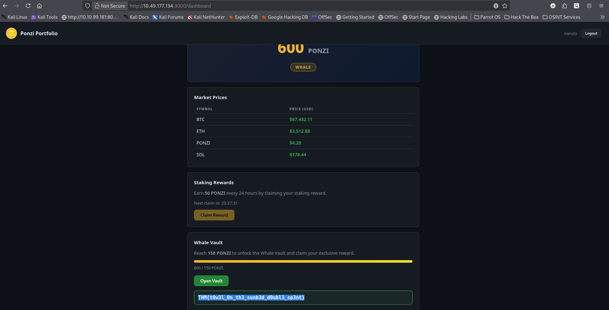

# [Towel on the Sunbed](https://tryhackme.com/room/hh-towelonthesunbed-61271709)

* Day 8 of Hacker Holidays 2026.
* It is a web-based challenge.





* Visit the target URL in a browser.



* This is a Ponzi portfolio application. As the challenge description mentions a **business logic vulnerability**, I am **not** performing any authentication bypass techniques. Instead, I register a new account and log in to the web application.



* The site says we can claim **50 PONZI every 24 hours**. Before interacting with the application, start **Burp Suite** (or your preferred proxy) to intercept all requests so we can understand how the application works.

* While Burp Suite was recording all my requests in the background, i started inspecting the site, I found a JavaScript file called **dashboard.js**.



* The script reveals a lot about how the application works:

```
- **Page loads**
- loadDashboard() is called automatically. It requests the user's dashboard data from: **GET /dashboard/api/me**
- If the user is not logged in (HTTP 401), they are redirected to: **/auth/login**

- **Display user information**
- Shows the logged-in username.
- Displays the user's current PONZI balance.
- Displays the user's membership tier (e.g., Bronze, Silver, Gold).

- **Display cryptocurrency prices**
- Reads the prices array returned by the server.
- Creates a table showing each cryptocurrency symbol and its current USD price.

- **Daily reward system**
- Checks whether the user can claim a reward.
- If they can: Enables the Claim button.
- Otherwise: Starts a countdown timer showing how long until the next claim is available.

- **Progress toward Whale status**
- Uses a constant: const WHALE_THRESHOLD = 150;
- Displays a progress bar showing how close the user's balance is to 150 PONZI.

- **Vault access**
- If the balance is below 150 PONZI: The Vault button is disabled.
- If the balance reaches 150: The button becomes clickable.

- **Claim button**
- When clicked: **POST /claim**
- The server awards a reward.
- Displays: Claimed! +10 PONZI.
- Reloads the dashboard so the balance and timer are updated.

- **Vault button**
- When clicked: **GET /vault**
- If access is allowed: Displays the secret/flag returned by the server.
- Otherwise: Displays an error such as: Vault locked.

- **Logout button**
- Sends: **POST /auth/logout**
- Then redirects the user back to the login page.
```

* The line **`const WHALE_THRESHOLD = 150`** indicates that once a user's balance reaches **150 PONZI**, they are considered a **Whale**, allowing them to access the vault.

* To verify whether this restriction is enforced only on the client side, I tried accessing the **`/vault`** endpoint directly using `curl`.

```
curl http://10.49.177.134:3000/vault \
-H "Cookie: connect.sid=s%3A7usxhIPs9bAfm5SOVqZr-ljytN8sWJ7n.ake%2FB6cm8OvAlh5HMuifEBtNq9vWI6%2FXm%2FnXVpBMkz0"
```

```
{"error":"Access denied. Whale-tier balance required.","currentBalance":50,"required":150,"shortfall":100}
```

* It didn't work, which means the restriction is enforced on the **server side** as well.

* Clicking the **Claim** button awards **50 PONZI**, but we have to wait **24 hours** before claiming again. Since the challenge focuses on a business logic vulnerability, I decided to test for a **race condition** by sending the **`/claim`** request to Burp Repeater.

* I created a fresh account, copied the new session cookie, and replaced the cookie in the **`/claim`** request inside Burp Suite.



* Next, I created a **Repeater group**, added multiple **`/claim`** requests to it, and sent all of them **in parallel**.

* A few of the requests were processed successfully before the server updated my claim status. After reloading the dashboard, my balance had increased to **600 PONZI**, and the **Vault** button became clickable.



**Flag:** `THM{t0w3l_0n_th3_sunb3d_d0ubl3_sp3nt}`
